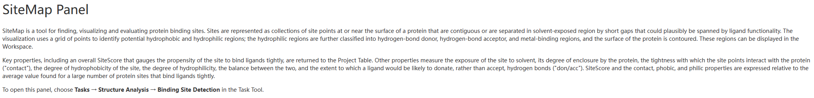
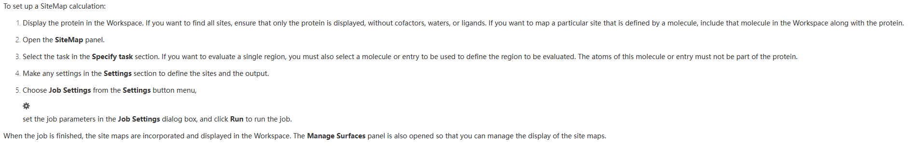
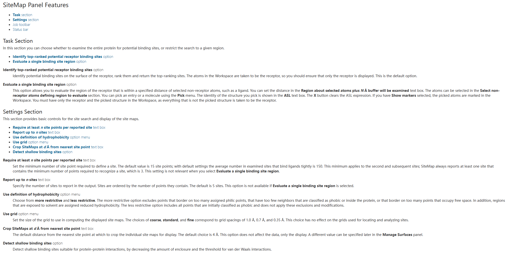

👏 Schrödinger|SiteMap模块寻找评估蛋白潜在结合位点

---
[TOC]

---
## Introduction
  

## How to use?
**Before using this module, you must prepare your protein with the module named Protein Preparation Wizard.**
Then
  

## Something about parameters  
