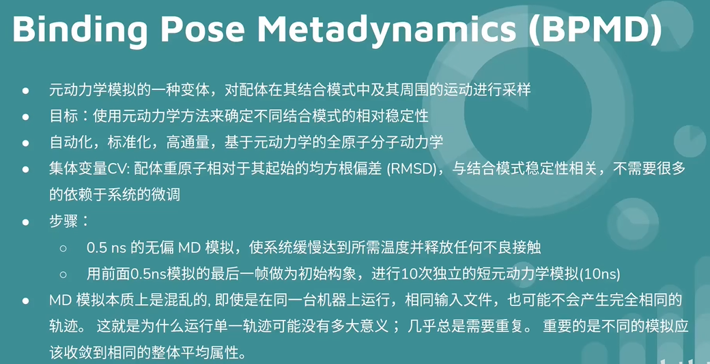
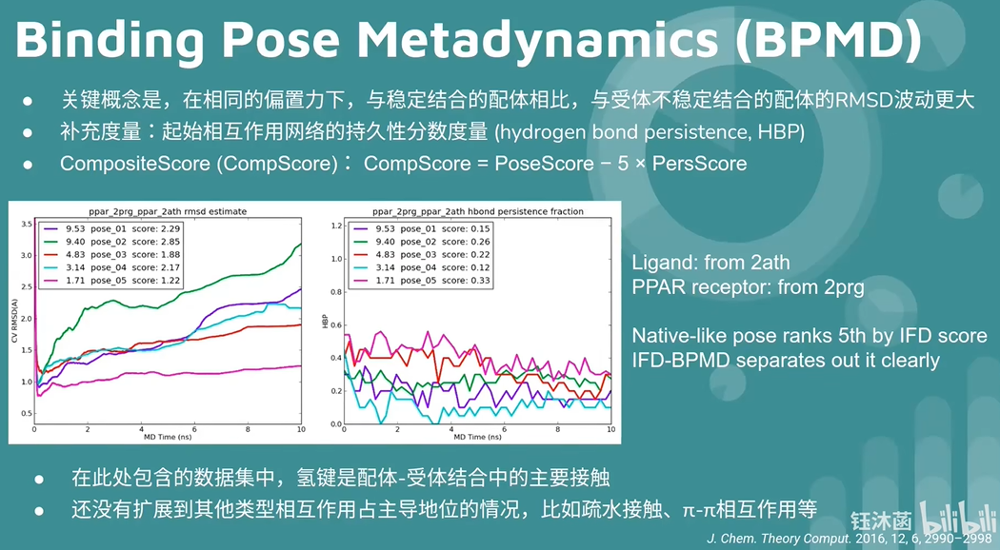
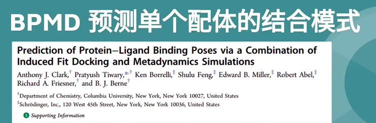
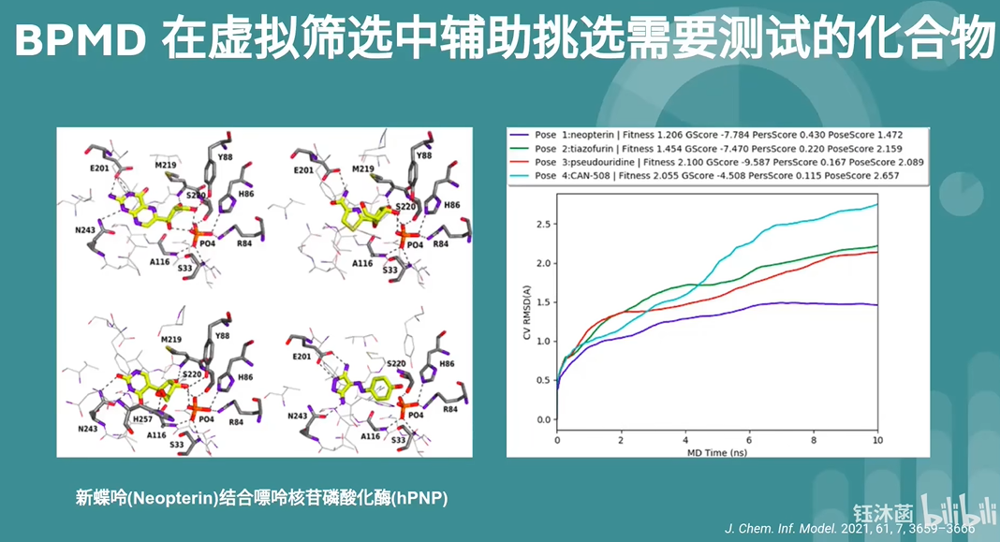
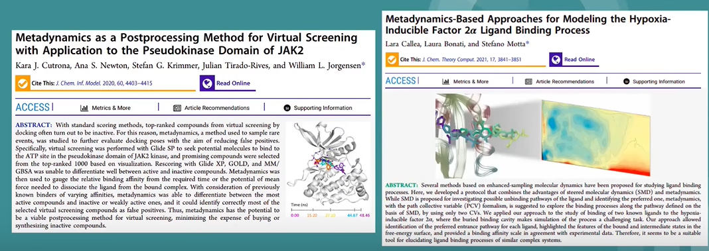

👏 Schrödinger|使用Binding Pose Metadynamics模块预测蛋白-配体结合模式

---
[TOC]

---
## 简介

## 应用场景
（1）预测单个配体的结合模式。
（2）研究蛋白结晶结构中的配体构象稳定性。
（3）在晶体结构分辨率低的情况下，辅助解析结构。
（4）在虚拟筛选中辅助挑选需要测试的化合物。

## 相关应用文献

## 参考资料
1. [薛定谔Binding Pose Metadynamics-bilibili](https://www.bilibili.com/video/BV13f4y1G7bW/?spm_id_from=333.999.0.0&vd_source=85aa5c7a4e0e5230f6f0f254cff40367)