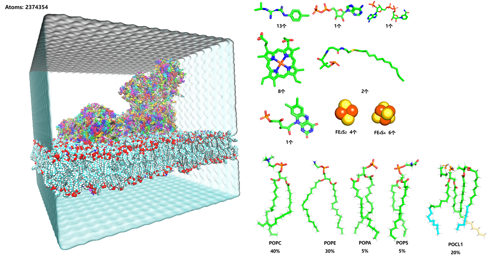

👏 SuperComplex复杂体系的分子动力学模拟

---
[TOC]

---
## 案例一
如下图所示，含有79条蛋白链，内质网膜，以及多种配体小分子以及无机小分子的建模以及MD。  
  

**（1）首先拿到冷冻电镜结构第一步要做的就是对蛋白进行链重命名，方便进行后续的可视化。**  
建议分链按照segment:chain进行分，segname按照PRA，PRB，PRC……进行编排，chain按照26个大写字母进行编排。可使用下述脚本：  
```python
def rename_chain_number(pdb):
    
    new_chain = [" A", " B", " C", " D", " E", " F", " G", " H", " I", " J", " K", " L", " M", " N", " O", " P", " Q", " R", " S", " T", " U", " V", " W", " X", " Y", " Z"]
    seg = ["PRA", "PRB", "PRC", "PRD", "PRE", "PRF", "PRG", "PRH", "PRI", "PRJ"]

    with open(pdb) as f:
        f1 = f.readlines()

    old_chains = list()
    for i in f1:
        if i.startswith("ATOM") or i.startswith("HETATM"):
            old_chains.append(i[20:22])
    # old_chains = list(old_chains)
    # old_chains.reverse()
    old_chains = sorted(set(old_chains), key=old_chains.index)
    print("old_chains: ", old_chains)

    cycles = len(old_chains)//len(new_chain)
    others = len(old_chains)%len(new_chain)
    new_seg_chains = []
    for i in range(cycles):
        for j in new_chain:
            new_seg_chains.append(seg[i]+j)
    for i in new_chain[:others]:
        new_seg_chains.append(seg[cycles]+i)

    print("new_seg_chains: ", new_seg_chains)

    dic_old_new = dict(zip(old_chains, new_seg_chains))

    rt = open(pdb.strip(".pdb")+"_rechain.pdb", "w")
    # idx = 1
    # for i in f1:
    #     if i.startswith("ATOM") or i.startswith("HETATM"):
    #         if idx <= 99999:
    #             rt.write(i[0:6]+'{:5d}'.format(idx)+i[11:20]+dic_old_new[i[20:22]][-2:]+i[22:72]+dic_old_new[i[20:22]][:3]+i[75:])
    #         else:
    #             rt.write(i[0:6]+'{:5d}'.format(99999)+i[11:20]+dic_old_new[i[20:22]][-2:]+i[22:72]+dic_old_new[i[20:22]][:3]+i[75:])
    #     else:
    #         rt.write(i)

    for i in f1:
        if i.startswith("ATOM") or i.startswith("HETATM"):
            rt.write(i[0:20]+dic_old_new[i[20:22]][-2:]+i[22:72]+dic_old_new[i[20:22]][:3]+i[75:])
        else:
            rt.write(i)
```

**（2）将配体小分子以及无机小分子等全部单独提取保存并生成结构和力场。**  
有机小分子建议每种小分子建一个文件夹，首先使用CHARMMGUI查看每种小分子是否完整存在于力场文件中，若存在于力场文件中需要将配体（可能多个配体组成的一个pdb文件）去氢，然后原子名称与力场拓扑的名称对应上然后使用pdb2gmx生成itp以及加氢后的pdb文件（其实有两种做法，第一种是将多个配体放在一个pdb文件中使用pdb2gmx生成itp，然后总topol中的[ molecules ]中数量写一个就行；第二种就是将一个配体放在pdb文件中生成itp，然后总topol中的[ molecules ]中写清数量就行，推荐第一种）。   
对于没有力场的小分子，对于同种分子多个的建议对每一个分子都上传到cgenff中产生力场参数以及拓扑，不然将原子名称与topol文件对应起来太麻烦，还容易出错。   
无机小分子如果cgenff无法产生topol的话建议使用"产生力场参数以及Gromacs拓扑文件的工具-Sobtop"进行新定义原子类型并生成prm，itp。  

**（3）建立蛋白的topol。**  
个人倾向的做法是：将蛋白分成一条一条链（包含金属离子，有的时候需要修改金属离子的名称），然后分别对每条链使用pdb2gmx（建议使用-merge all 将所有都写到一个topol.top文件中）生成每条链的topol.top以及pdb文件。将topol删除首尾生成itp文件，并且修改每个itp的名称。将pdb文件中杂行全部删除，只保留坐标行。    

**（4）建立总topol。**   
示例如下文件所示：[topol.top](./SuperComplex复杂体系的分子动力学模拟/topol.top)

**（5）将蛋白插入到膜中。**   
可能需要在对pdb的链进行命名，然后合并所有pdb。使用pymol将蛋白拖入膜中并调整蛋白的位置。删除蛋白周围0.8埃范围内的左右脂分子。保存蛋白以及膜的坐标（切记在pymol中保存勾选下面选项，保存原子的顺序）。    
     
将蛋白以及膜的pdb合并并转成gro文件，并修改topol.top文件中脂分子的数量进行修改（因为删除了一部分脂分子）。   
生成盒子，加水，加离子，删除膜中的水分子和离子并修改对应的topol.top文件。   

**（6）进行模拟**  
建议：可按照CHARMMGUI上的mdp文件逐步对脂分子进行限制与放开，另外，对于蛋白和水，蛋白前两步限制重原子，后面放开。水一直限制Z轴。另外在全部放开后再加一个npt文件，用于将水完全放开并调整盒子大小。最后完全放开进行MD即可。   