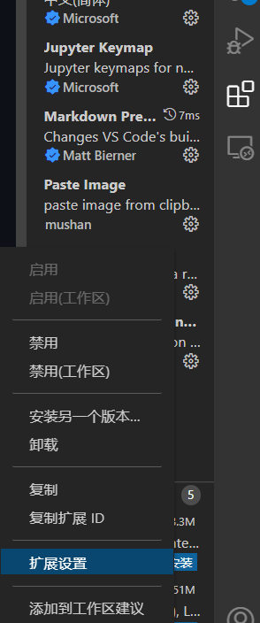

👏 VSCode插件|Markdown图片插入插件PasteImage

---
[TOC]

---
## 插件说明
在使用VSCode进行Markdown文件写作时往往会需要在文件中插入图片，Paste Image是VSCode的插件，可以通过快捷键的方式将粘贴板中的图片保存到本地文件夹中并且插入到文本中。

## 变量说明


## 安装及配置
(1) 在VSCode的扩展应用中搜索安装即可。  
(2) 在这里将图片的粘贴格式设置为如下格式，例如，在aaa.md文件中粘贴图片，即自动在aaa.md的同级目录下新建一个aaa的文件夹，并将图片以aaa-year-month-day.png的格式保存在aaa文件夹下并插入到aaa.md中。具体操作如下：  
- 打开修改设置：  
  
- 将"Paste Image: Name Prefix"修改为如下：
```json
${currentFileNameWithoutExt}_
```
- 将"Paste Image: Path"修改为如下：
```json
${currentFileDir}/${currentFileNameWithoutExt}/
```

## 常见问题
(1) Ctrl+Alt+v突然不能用于在markdown中粘贴图片？  
可能原因：快捷键冲突，之前遇到过将有道词典打开则pasteimage不能使用，后来发现是因为有道词典的一个快捷键就是Ctrl+Alt+v。将有道快捷键修改后就能重新使用。  