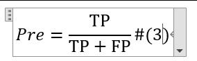

👏 Word|如何在数学公式后面加序号？

---
[TOC]

---
## Latex公式键入
(1) 格式  
成品的格式如下图所示，公式居中，但是公式后面的序号右对齐。

(2) 插入公式  
这里就不具体讲插入公式的具体做法。可采用MarkDown语法插入公式，也可采用墨迹公式等。

(3) 输入公式序号  
注意：将光标位于公式编辑框内的末尾。输入“#(3)”，然后点击键盘回车(Enter)键即可。最后Word会自动将序号放置于公式最右端(右对齐的位置)。

## 表格法输入
(1) 插入一个 1x3 的表格。  
(2) 在中间格中输入公式，设置居中对齐。  
(3) 在右侧格中输入序号，设置右对齐。  
(4) 适当调整行距即可。  