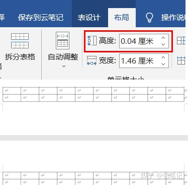
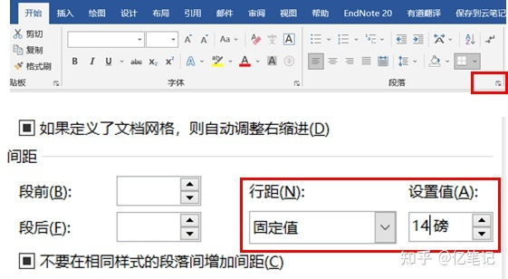

👏 Word|如何随意调整Word中表格的高度？

---
[TOC]

---
今天帮小朋友做一个表格，要求是一张A4纸上，52*10的表格。

(1) 首先在Word中插入52*10的表格，发现插入的表格占了两页。不断调整表格的高度，发现表格的高度是有下限的，无法继续降低表格高度。

(2) 后来发现主要是由于行距限制了表格高度的调整。所以调整表格的行距即可随意调整表格的高度从而使得表格呈现在一张纸上。如下：

