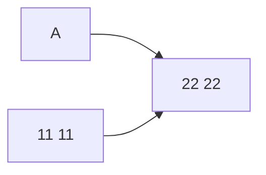
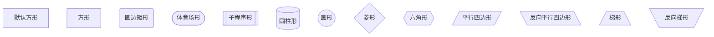
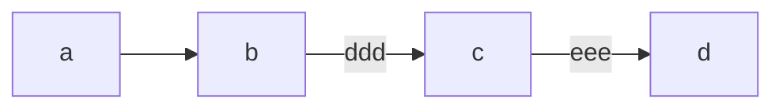
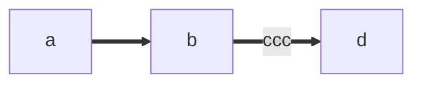
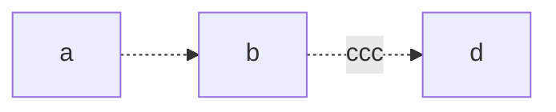
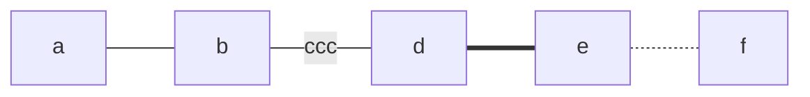
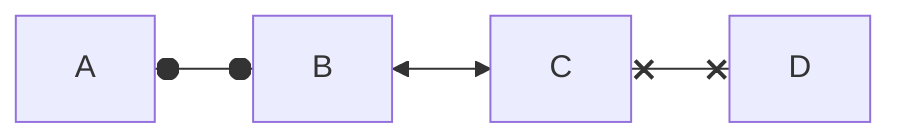

👏 mermaid|mermaid绘制流程图

---
[TOC]

---
## 基本参数
### 控制绘图方向
用于开头，声明流程图的方向。  
> graph或graph TB或graph TD：从上往下  
> graph BT：从下往上  
> graph LR：从左往右  
> graph RL：从右往左  

### 节点
(1) 节点名字与节点内容  

如上图所示：  
- A,B,C均是节点的名字，11 11和22 22均是节点内容。
- []代表节点的边框。  
- 如果节点没有写边框和内容，则默认边框为方形，内容与名称相同。  

(2) 节点的样式  

### 连接
(1) 实线箭头  

(2) 粗实线箭头  

(3) 虚线箭头  

(4) 无箭头线

(5) 其他的连线  

---
## 绘图实例

---
## 参考资料
1. https://mermaid-js.github.io/mermaid/#/  
2. https://zhuanlan.zhihu.com/p/355997933  
