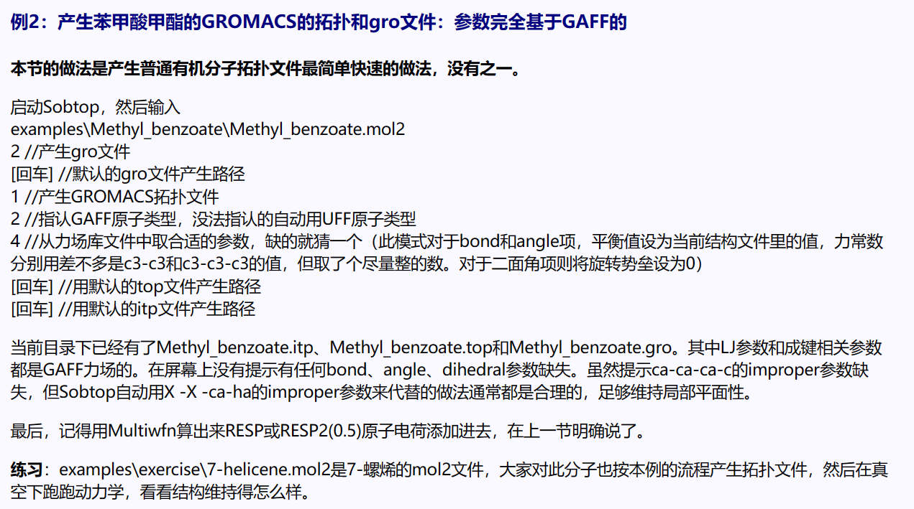

👏 产生力场参数以及Gromacs拓扑文件的工具-Sobtop

---
[TOC]

---
## 程序源文件
[sobtop_1.0(dev3.1).zip](产生力场参数以及Gromacs拓扑文件的工具-Sobtop/sobtop_1.0(dev3.1).zip)

## 使用说明
* [Sobtop：A tool of generating forcefield parameters and GROMACS topology file](http://sobereva.com/soft/Sobtop/#ex2)

## 用途
1. 产生一些奇怪的无机化合物的参数以及拓扑，例如FE2S2, FE4S4.
