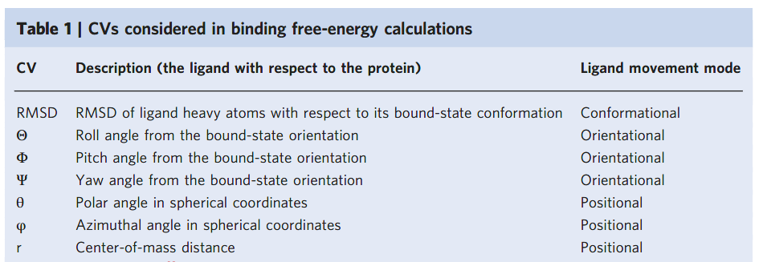
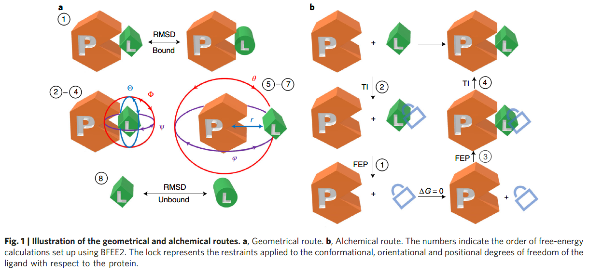
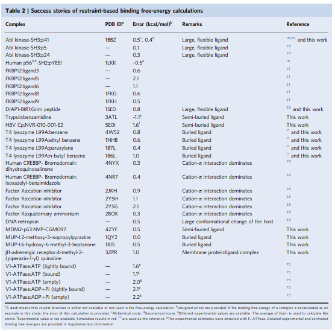
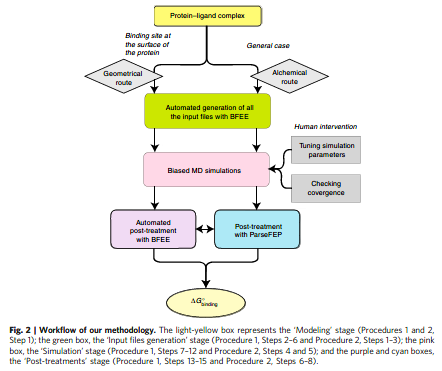

👏 使用分子动力学模拟准确计算蛋白配体的标准结合自由能

---
[TOC]

---
## 摘要
&emsp;&emsp;设计一种可靠的计算方法计算蛋白配体的标准结合自由能是极具挑战的。在原始的模拟中很难捕获到蛋白配体结合解离过程中所伴随的构型焓和熵的巨大变化。为解决该问题，这里提出了基于严格统计力学的框架用于确定蛋白配体的结合亲和力以及开发了其应用软件BFEE2。通过实验或者对接获取蛋白配体结合态，应用BFEE2流程以及合适的力场即可计算获得一定化学精度的标准结合自由能。BFEE2帮助终端用户自动处理必要的输入文件，进行模拟并且评估结合自由能。

## 正文
&emsp;&emsp;蛋白配体结合以及解离过程的理解和预测在生物和化学领域都是非常重要的，特别是蛋白质工程以及药物科学领域。结合自由能直接反映了配体与蛋白互作的能力，因此也被视为蛋白配体结合解离现象研究中的关键参量。然而实验确定蛋白配体的结合自由能通常需要花费大量的时间和金钱。为了解决药物设计以及先导化合物优化的这个重要难关，研究人员已经开发了一些计算方法用于准确评估结合自由能。
&emsp;&emsp;通过计算模拟方式评估结合自由能的主要挑战在于捕获结合解离过程中配体相对于蛋白的构象、朝向和位置移动所对应的构型焓变和熵变。一种策略是结合动力学模拟和增强采样对每一自由度都充分采样，然而增强采样依旧很难捕获蛋白配体的结合解离可逆过程。一种克服这种采样缺点的办法是在几何分离或者炼金术解耦过程的中间步骤中引入一个限制势控制配体相对蛋白结合位点的移动。在一端引入一个限制势限制结合位点中的未解耦配体，在另一端释放配体。基于在解离和解耦过程中引入限制势限制配体计算结合自由能的方法，作者自1996年便开发了一系列模拟策略和软件。

### 流程开发
&emsp;&emsp;所有的计算策略和算法都整合在bfee2软件中，并且能和可视化软件vmd一起使用。除了一些最简单的体系，无偏暴力动力学很难采样到蛋白配体结合解离过程中的大的构象变化、平移变化和朝向变化。为了解决这个问题，我们提出在几何或者炼金术状态转换时通过使用构型限制控制采样并对计算过程公式化。2013年研究人员展示几何路径和炼金术两种方法的计算结果相同。依赖于特定的状况，每条路径的特征能被更好利用并综合应用于蛋白配体间标准结合自由能的计算。与选择的路径无关，使用表1中一系列基于模版和普通的集合（cvs）时，限制会被谨慎的添加和计算。

### 几何路径
&emsp;&emsp;在几何路径中，一点一点的引入限制势作用于配体，使配体相对于蛋白发生构象变化以及朝向移动从而使得配体沿着直线路径进行完全分离。这样的研究对象转变伴随着的自由能可由平均力势（pmf）表现出来。各种限制对于结合自由能的贡献可通过wtm-eabf使用pmf进行计算。如下图1a所示。

### 炼金术路径
&emsp;&emsp;在炼金术路径中，使用如图1b所示的热力学循环进行模拟。

### 方法的应用
&emsp;&emsp;如下表2所示。

### 和其他方法的比较
&emsp;&emsp;有多种评估蛋白配体结合自由能的方法。这些方法各有优缺点，选择合适的方法解决特定的问题是非常重要的。mmpbsa需要一条溶剂化的蛋白配体平衡的动力学轨迹。但是由于该方法使用的是隐形溶剂并且不能完全捕获大的构象变化所带来的影响。所以该方法的可靠性仍不确定。漏斗元动力学结合了几何限制以及元动力学技术，平衡了准确率和效率，非常适合用于研究刚性配体。但是对于柔性配体以及埋藏的配体，会面临收敛性问题并且难于选择合适的集合描述配体在蛋白上的相对移动。这些方法与文中介绍的流程具有内在相似性。例如，双精度解耦方法和炼金术可视为彼此的变体。attach-pull-release方法与几何路径方法类似，使用pmf计算蛋白配体的解离。我们的方法bfee2与其他方法的一个主要区别在于整个自由能计算流程的流程化以及自动化。

### 文中计算流程的优点和缺点
**优点**
* 严密的理论，一些方法用速度换取精度，就像mmpbsa。我们保证我们的方法具有缜密的理论基础，在力场精度下自由能计算能够收敛。
* 对大多数蛋白配体复合物都具有普适性。软件设计时考虑了球蛋白和膜蛋白、半埋藏配体和蛋白表面配体、刚性和柔性配体等。
* 能够克服构型采样空间的困难。在该方法中，使用一维pmf或者炼金术进行计算，通过引入构型限制减少了构型空间的采样。避免了多维自由能计算的多维问题，也避免了捕获蛋白配体大的构象变化的需要。
* 最小的人们干预，bfee2是一个用户友好型流程化与自动化软件。
* 收敛性易于评估。pmf计算或炼金术计算的收敛性可以直接通过用户友好的界面工具进行评估。
* 结果的鲁棒性和可重复性。
**缺点**
* 依赖力场。自由能计算的整体精度依赖于使用的力场。终端用户需要有一定的力场知识储备。
* 极度深埋的配体。该方法可用于计算埋在蛋白中的配体结合自由能。对于深埋的配体，捕获溶剂重组，配体结合解离时水进入离开结合位点需要长时动力学模拟才能收敛。动力学专家使用增强采样rest2和rep结合来解决这个问题。但是这种方式还没在bfee2中实现，需要用户手动产生输入。
* 具有肉眼可见的结合态与非结合态巨大构象变化的配体。在多数情况下，键合态和非键合态配体构象时不同的。在该文的流程中与键合态的rmsd用作cv描述配体的构象变化。尽管此适用于大多数类药分子，但是一些配体的构象如核糖环的折叠对于rmsd不敏感。有经验的终端用户可能想将默认的rmsd指标修改为其他的cv。
* 计算资源。

### 其他要点
* 需要原始的结合模式。很难确定假定的厨师结构对于方法计算的影响。由于自由能方法依赖于构象采样，原则上该流程能够探索到假定姿势周围的空间，但是模拟可能产生两种不同结果。如果假定的初始结构非常不准确，最终计算的输出结果也会更加不确定。实际上，相对准确的初始结构将减少计算资源并且能够获得更高的准确度。

### 总览全文
&emsp;&emsp;在整个计算流程中，作者介绍了几何路径、炼金术等来进行蛋白配体标准结合自由能的计算。评估蛋白配体结合自由能一共需要四个步骤：
（1）建模。产生结构文件以及md需要的拓扑文件。用charmm-gui或者ambertools生成。
（2）生成输入文件。
（3）模拟。这个阶段需要进行不同的动力学模拟。这个阶段需要人工观察收敛性。
（4）后处理。基于动力学模拟的输出文件计算结合亲和力。

### 需要完成整个流程的技术
&emsp;&emsp;终端用户需要知道如何使用namd或者gromacs进行动力学模拟。需要知道研究对象三维结构的确定条件，离子强度、ph和质子化状态等。

### 实验设计流程

#### 建模
&emsp;&emsp;终端用户哟哟生成md需要的结构以及拓扑文件。从pdb数据库中获取或者分子对接生成。

#### 生成输入文件
&emsp;&emsp;在这一步中bfee2将产生自由能计算所需要的配置文件。终端用户需要选择使用几何路径还是炼金术进行计算。前者适合配体在蛋白表面的复合物结构，后者适合任何的复合物结构。尽管bfee2的整个流程都是自动化的，但是终端用户需要检查并微调一些参数。

#### 模拟

#### 后处理
&emsp;&emsp;进行自由能计算以及分析蛋白配体间相互作用。

## 参考文献
1. Fu H, Chen H, Blazhynska M, et al. Accurate determination of protein: ligand standard binding free energies from molecular dynamics simulations[J]. Nature Protocols, 2022, 17(4): 1114-1141. [文献pdf](./使用分子动力学模拟准确计算蛋白配体的标准结合自由能/s41596-021-00676-1.pdf)