👏 共价对接|共价蛋白-配体结合的结构预测方法Cov_DOX

---
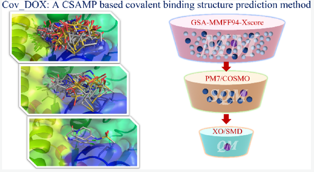 

&emsp;&emsp;许多共价药物设计依赖于化合物与蛋白准确的共价结合姿势。尽管现在很多分子对接软件可以进行共价对接，但成功率仅有40%-60%，所以这篇文章作者开发了一种杂化方法，称为Cov_DOX，用于预测共价化合物结合姿势。在含有各种类型共价复合物的测试集上，成功率高达81%。   

&emsp;&emsp;共价药物一直在临床上发挥着重要作用，比如最著名的“神药”阿司匹林。除了实验解析晶体结构，基于结构的共价药物设计（SBDD）需要准确的蛋白配体复合物结构，共价对接是目前解决该问题常用方法之一。目前的共价对接软件主要有：WIDOCK、AutoDock4、GOLD、FITTED、ICM-Pro、CovDock、MOE、DOCKovalent、Covalent-Dock和DOCKTITE。

&emsp;&emsp;有两项研究对这些共价对接软件进行了基准测试。其中[J. Chem. Inf. Model. 2018, 58, 7, 1441–1458](https://pubs.acs.org/doi/abs/10.1021/acs.jcim.8b00228)一文中使用含有207个共价复合物的测试集对AutoDock4、CovDock、FITTED、GOLD、ICM-Pro和MOE进行评估，共价配体姿势预测正确率在40%-60%，其中ICM-Pro表现最好。[Molecules 2019, 24(11), 2183](https://www.mdpi.com/1420-3049/24/11/2183)文中则使用BCDE测试集对MOE、GOLD、 CovDock和ICM-Pro进行评测，此次评测中ICM-Pro表现最差。出现反差的原因可能是测试集的差别，这也说明目前的共价对接软件容易受到共价结合类型的影响，不具有普适性，有较大改进空间。  

---
&emsp;&emsp;本文中作者提出了一种称为Cov_DOX的共价结构预测流程。如图1所示，该流程分为从粗略到中等再到精细三个层次的计算。  

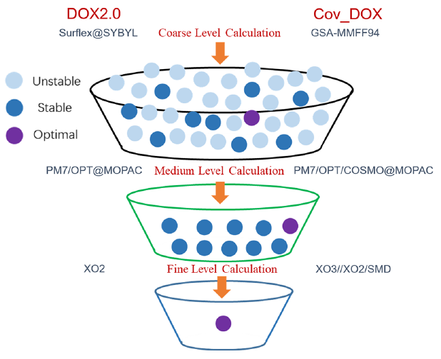
图1 用于非共价配体的DOX2.0和这篇文章中用于共价配体的Cov_DOX流程设计示意图

**粗略水平：广义模拟退火。** 该层次的目的在于确保搜索到的构象空间尽可能包括希望初步得到的“较好姿势”。文中使用的构象搜索算法是广义模拟退火（GSA），相较于标准模拟退火算法，GSA获得的构象更加多样。GSA算法如图2所示，产生用于GSA采样的初始化构象，文中使用AutoDock4共价对接产生的前5种构象作为初始构象 -> 计算构象能量 -> 降温、计算二面角改变量并更新构象 -> 根据新构象与初始构象间能量差或者计算新构象的可接受因子确定是否接受新构象 -> 将符合条件的构象加入构象集中输出。使用X-Score将GSA产生的前1000名构象排名并取前300的构象作为粗略水平构象产生的结果。  

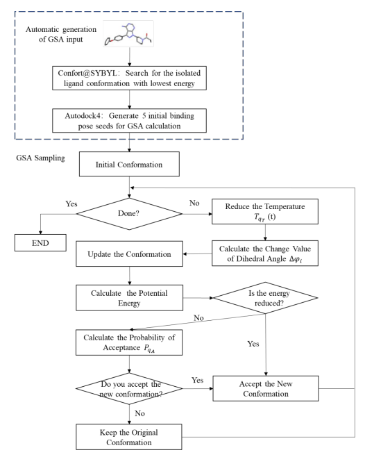  
图2 GSA算法流程图  

**中等水平：PM7/COSMO/OPT。** 该层次的目的在于使用量化计算方法确保“正确构象”包含在排名前10的候选构象中。如图3所示，具体则是一起使用COSMO溶剂化模型和PM7哈密顿量对配体及其周围（< 3Å）蛋白质残基簇进行几何优化和能量评估。选出前10的优势构象。  
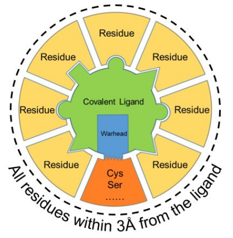
图3 PM7计算流程  

**精细水平：XO2/OPT和XO3/SP。** 该层次的目的在于从上一层次产生的10个候选构象中选出最终的“正确构象”。这里使用XO方法（[Chem. Phys. Lett. 2010, 498, 203−208](https://doi.org/10.1016/j.cplett.2010.08.033)和[J. Comput. Chem. 2012, 33, 2142−2160](https://doi.org/10.1002/jcc.23051)）计算每个精细水平的构象能量。如图4所示，取配体周围7埃范围内所有残基进行计算，并将其分为高水平区（3埃范围内残基）和低水平区。进一步将高水平区分成片段使用XO方法进行计算并进行能量评估。低水平区使用PM7进行计算并能量评估。最后综合各个层次计算结果对10个候选构象进行评估选出一个最有潜力的预测构象。    
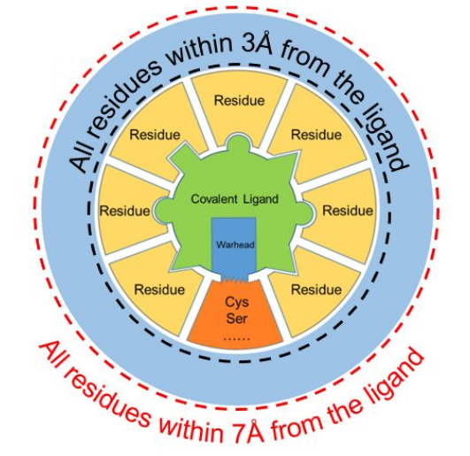
图4 XO计算流程

---
**Cov_DOX与其他共价对接软件比较构象预测能力。** 如图5所示。  
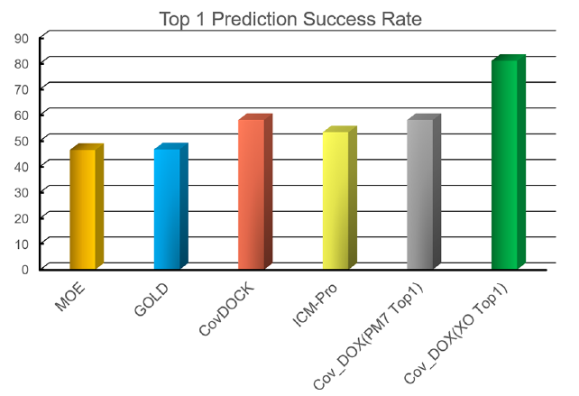
图5 Cov_DOX与其他共价软件的top1构象预测成功率（RMSD < 2埃）  

**粗略水平采样能力评估。** 如图6和表1所示。  
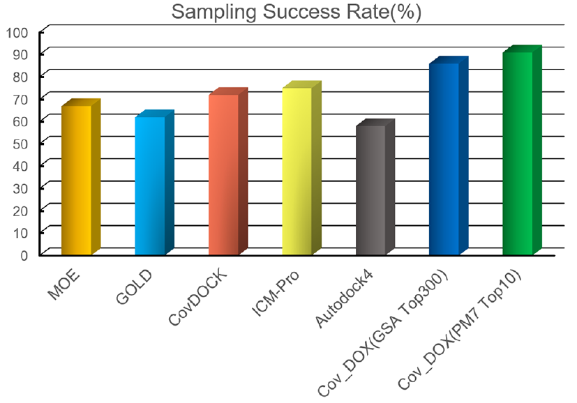  
图6 Cov_DOX与其他共价软件采样能力的评估  

**中等水平的精炼能力。** 如图6和图7所示。  
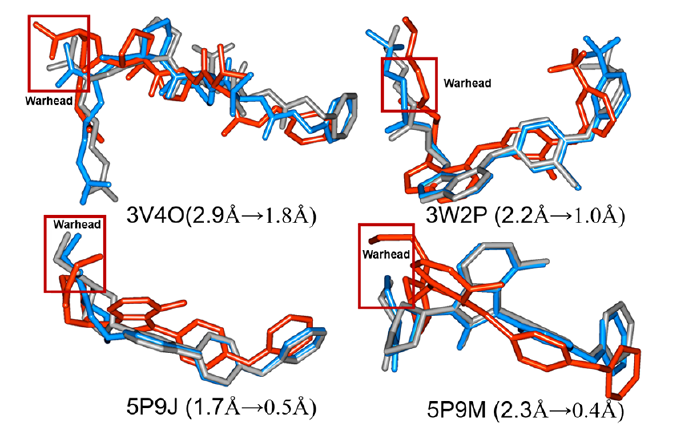  
图7 比较晶体结构、粗略水平和中等水平的4个案例  

**精细水平的排序能力。** 如图1和下表所示。  
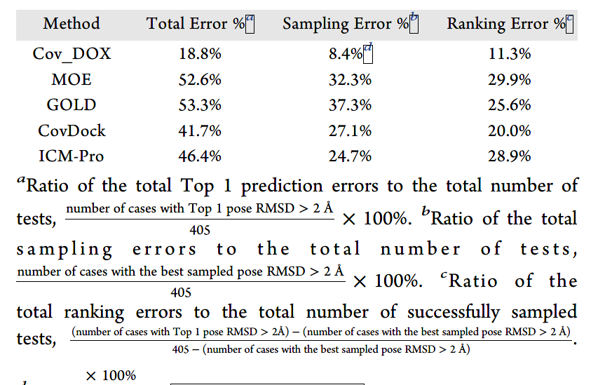  
表1 测试集上各种共价方法的采样误差和排序误差  

**Cov_DOX的适用性评价。** 如下表所示，对配体共价弹头、共价残基、蛋白类型和配体柔性分别进行评测。  
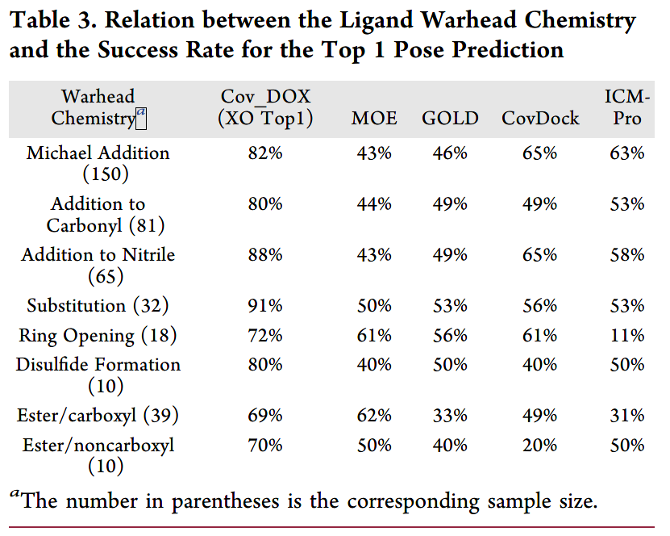  
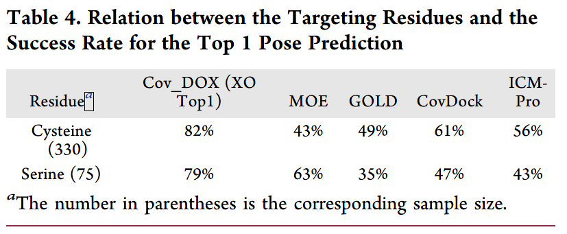  
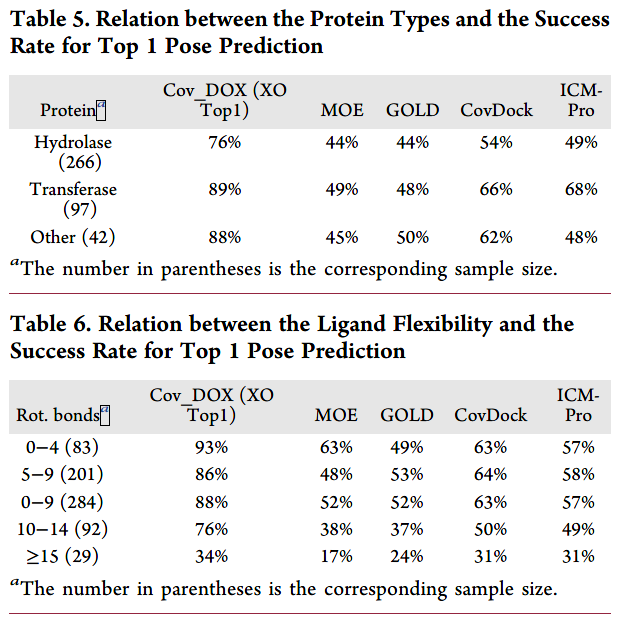  
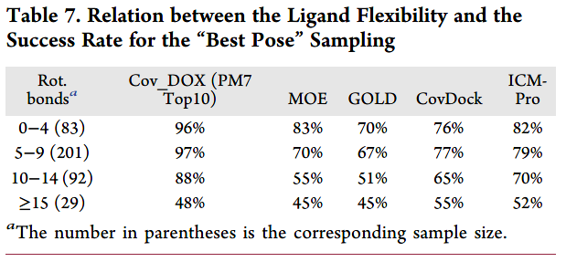  

**Cov_DOX配体构象预测准确度高但是计算代价很大。**  

**Cov_DOX的打分能力评价。** 如下图所示。  
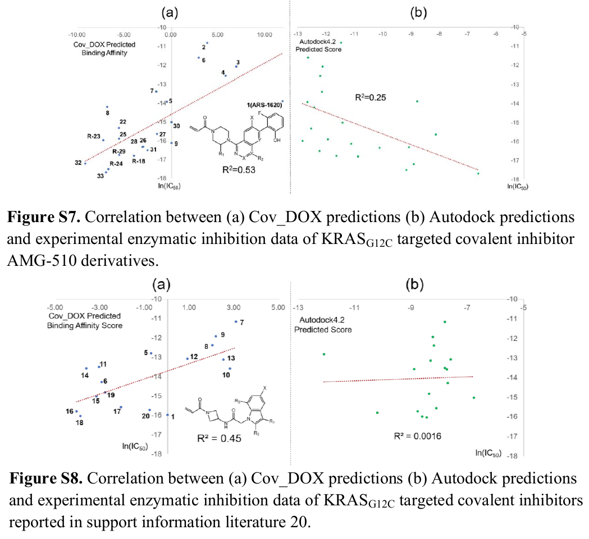  

**小节：** 这篇文章在共价对接中引入量子化学计算构象能量。提高了共价结合构象预测准确率，有助于共价药物的结构改造。但是计算量非常大，不适合用于虚拟筛选。  

## 参考文献
1. Wei L, Chen Y, Liu J, Rao L, Ren Y, Xu X, Wan J. Cov_DOX: A Method for Structure Prediction of Covalent Protein-Ligand Bindings. J Med Chem. 2022 Apr 14;65(7):5528-5538. doi:10.1021/acs.jmedchem.1c02007.  [原文pdf](../File/共价对接共价蛋白-配体结合的结构预测方法Cov_DOX/acs.jmedchem.1c02007.pdf)  [附加材料pdf](../File/共价对接共价蛋白-配体结合的结构预测方法Cov_DOX/jm1c02007_si_003.pdf)
