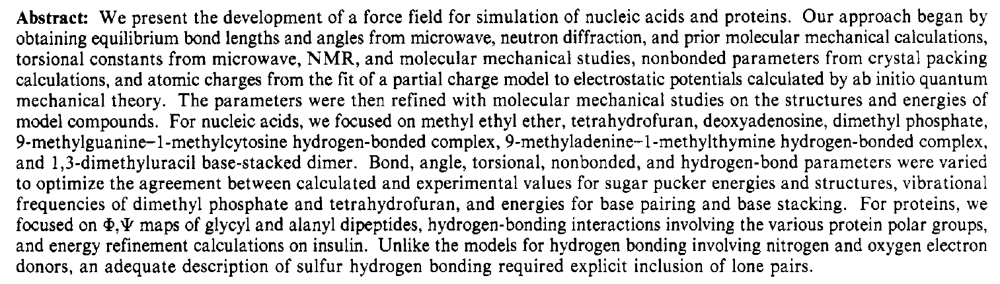

👏 分子力场|AMBER力场

---
[TOC]

---
* **第一篇Amber力场文献** Weiner S J, Kollman P A, Case D A, et al. A new force field for molecular mechanical simulation of nucleic acids and proteins. Journal of the American Chemical Society, 1984, 106: 765-784. [文献pdf](./分子力场第一个用于蛋白质和核酸的AMBER力场/ja00315a051.pdf) (**1984**)

* [**ff19SB**: Amino-Acid-Specific Protein Backbone Parameters Trained against Quantum Mechanics Energy Surfaces in Solution](https://pubs.acs.org/doi/abs/10.1021/acs.jctc.9b00591)

* [**ff14SB**: Improving the Accuracy of Protein Side Chain and Backbone Parameters from ff99SB](https://pubs.acs.org/doi/abs/10.1021/acs.jctc.5b00255)

* 