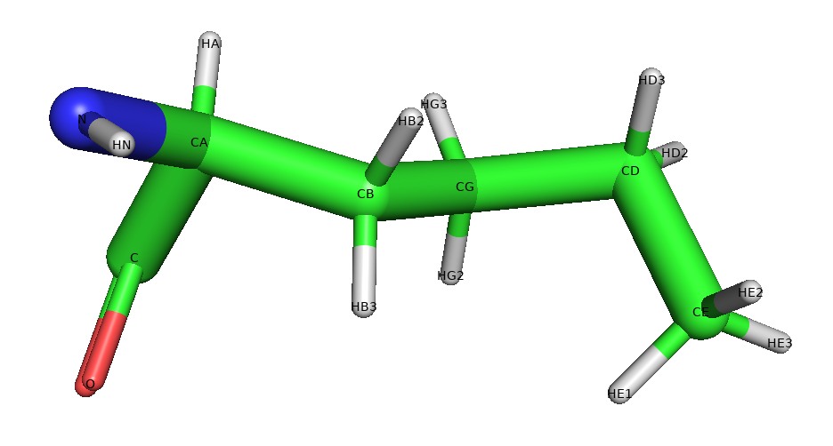
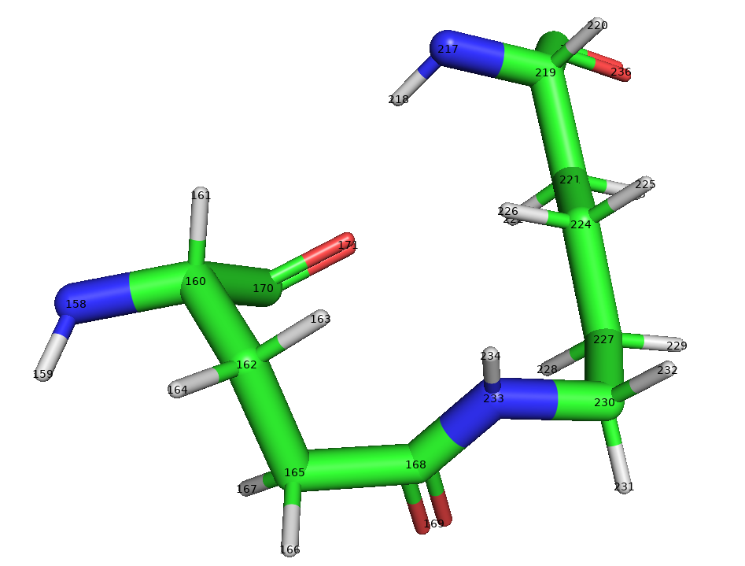
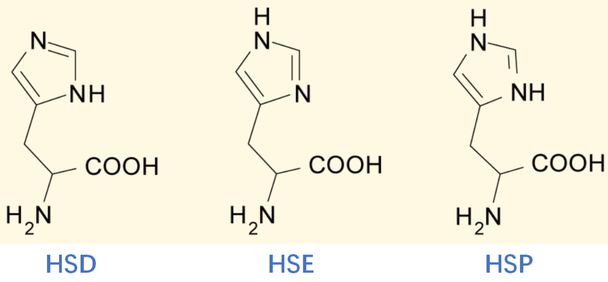
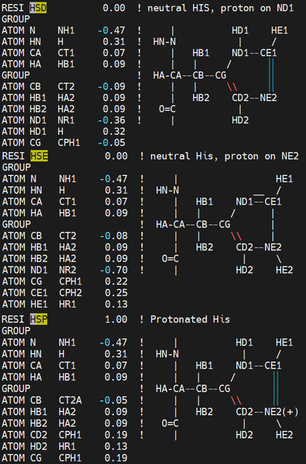

👏 分子力场|CHARMM力场

---
[TOC]

---
## NAMD中charmm36力场文件
### Charmm力场文件
网址：http://mackerell.umaryland.edu/charmm_ff.shtml
|说明|文件|
|:----|:----|
|The July 2022 update of the c36 toppar files includes minor additions and corrections as described in toppar_all.history.|[toppar_c36_jul22.tgz](分子力场CHARMM力场/toppar_c36_jul22.tgz)|

**[力场压缩包文件内各文件说明：](https://charmm-gui.org/?doc=toppar)**
- Protein topologies and parameters
top_all36_prot.rtf
par_all36_prot.prm

- Nucleic acids topologies and parameters
top_all36_na.rtf
par_all36_na.prm

- Carbohydrates topologies and parameters
top_all36_carb.rtf
par_all36_carb.prm

- Lipids topologies and parameters
top_all36_lipid.rtf
par_all36_lipid.prm

- CGENFF topologies and parameters
top_all36_cgenff.rtf
par_all36_cgenff.prm

- Additional topologies and parameters for protein
toppar_all36_prot_c36m_d_aminoacids.str   # D型氨基酸的拓扑以及力场参数
toppar_all36_prot_fluoro_alkanes.str
toppar_all36_prot_heme.str
toppar_all36_prot_na_combined.str
toppar_all36_prot_retinol.str

toppar_all36_prot_modify_res.str
[里面的结构如下所示](分子力场CHARMM力场/toppar_all36_prot_modify_res.cdxml)：

- Additional topologies and parameters for nucleic acids
toppar_all36_na_nad_ppi.str
toppar_all36_na_rna_modified.str

- Additional topologies and parameters for carbohydrates
toppar_all36_carb_glycolipid.str
toppar_all36_carb_glycopeptide.str
toppar_all36_carb_imlab.str

- Additional topologies and parameters for lipids
toppar_all36_lipid_bacterial.str
toppar_all36_lipid_cardiolipin.str
toppar_all36_lipid_cholesterol.str
toppar_all36_lipid_detergent.str
toppar_all36_lipid_ether.str
toppar_all36_lipid_hmmm.str
toppar_all36_lipid_inositol.str
toppar_all36_lipid_lps.str
toppar_all36_lipid_miscellaneous.str
toppar_all36_lipid_model.str
toppar_all36_lipid_prot.str
toppar_all36_lipid_sphingo.str
toppar_all36_lipid_yeast.str

- Additional topologies and parameters for spin / flourophore labels
toppar_all36_label_fluorophore.str
toppar_all36_label_spin.str

- Additional topologies and parameters for unnatural amino acid substitution
toppar_all36_uaa_cgenff.str
toppar_all36_uaa_gaff.str

- Additional topologies and parameters for water and ions
toppar_dum_noble_gases.str
toppar_ions_won.str
toppar_water_ions.str

- Additional CHARMM topologies and parameters used in Implicit Solvent Modeler are list below.
  - Additional topologies and parameters for ACE and FACTS_P19 model
  ace2parpx.inp
  acepar19.inp
  toph19.inp
  param19.inp

  - Additional topologies and parameters for EEF1 and SASA model
  toph19_eef1.inp
  param19_eef1.inp
  solvpar.inp

  - Additional topologies and parameters for GBSW and FACTS_P22 model
  top_all27_prot_na.rtf
  par_all27_prot_na_gbsw.prm
  radii_prot_na.str
  radius_gbsw.str

  - Additional topologies and parameters for GBWV model
  radii_prot_na.str

  - Additional topologies and parameters for SCPISM model
  scpism.inp

  - Additional topologies and parameters for EEF1/IMM1 model
  toph19_eef1.1.inp
  param19_eef1.1.inp
  solvpar.inp

  - Additional topologies and parameters for GBSWmemb model
  radii_prot_na.str

  - Additional topologies and parameters for GBMVmemb model
  radii_prot_na.str
  radii_prot_na.str

  - Additional topologies and parameters for PHMD model
  top_all27_prot_na_gbsw_phmd.rtf
  par_all27_prot_na_gbsw_phmd.prm
  par_phmd.inp
  radii_prot_na.str
  radius_gbsw.str

### 非标准残基top及prm
**正亮氨酸** 正亮氨酸的topol在toppar_all36_prot_modify_res.str文件中是有的。

```text
! NLE residue addition
RESI NLE          0.00
GROUP
ATOM N    NH1    -0.47  !     |
ATOM HN   H       0.31  !  HN-N
ATOM CA   CT1     0.07  !     |  HB3
ATOM HA   HB1     0.09  !     |   |
GROUP                   !  HA-CA--CB-HB2  HD2  HE1
ATOM CB   CT2    -0.18  !     |    \      /   /
ATOM HB2  HA2     0.09  !     |     CG--CD--CE--HE2
ATOM HB3  HA2     0.09  !   O=C    / \    \   \
GROUP                   !     |  HG2 HG3  HD3  HE3
ATOM CG   CT2    -0.18
ATOM HG2  HA2     0.09
ATOM HG3  HA2     0.09
GROUP
ATOM CD   CT2    -0.18
ATOM HD2  HA2     0.09
ATOM HD3  HA2     0.09
GROUP
ATOM CE   CT3    -0.27
ATOM HE1  HA3     0.09
ATOM HE2  HA3     0.09
ATOM HE3  HA3     0.09
GROUP
ATOM C    C       0.51
ATOM O    O      -0.51
BOND CB  CA   CG  CB   CD  CG   CE  CD
BOND N   HN   N   CA    C   CA   C   +N
BOND CA  HA   CB  HB2   CB  HB3   CG HG2 CG HG3 CD HD2
BOND CD  HD3  CE HE1  CE  HE2    CE HE3
DOUBLE  O   C
IMPR N -C CA HN  C CA +N O
CMAP -C  N  CA  C   N  CA  C  +N
DONOR HN N
ACCEPTOR O C
```
该氨基酸的prm参数标准残基里面都有。

### Link top及prm
**谷氨酸羧基侧链和赖氨酸氨基侧链形成的酰胺**

```text
PRES CONH         0    ! patch for amide.
                       ! use in a patch statement
                       ! follow with AUTOgenerate ANGLes DIHEdrals command
GROUP
ATOM 1CG  CT2    -0.28
ATOM 1HG1 HA2     0.09
ATOM 1HG2 HA2     0.09
ATOM 1CD  C       0.62
ATOM 1OE1 O      -0.81 !-0.05        HG1  OE1    HE1
!ATOM OE2  OC     -0.76               |   ||      |
ATOM 2CE  CT2     0.21              --CG--CD--NZ--CE--
ATOM 2HE1 HA2     0.05                |       |   |
ATOM 2HE2 HA2     0.05               HG2     HZ1 HE2
ATOM 2NZ  NH1    -0.35 !-0.05
ATOM 2HZ1 H       0.33
!ATOM HZ2  HC      0.33
!ATOM HZ3  HC      0.33
DELETE ATOM 1OE2
DELETE ATOM 2HZ2
DELETE ATOM 2HZ3
BOND 1CD 2NZ
```
使用：patch CONH PEP:10 PEP:14
缺少的参数如下所示，均是从类似的结构里面复制的。

```text

BONDS

ANGLES
C      CT2    CT2A    52.00    108.00 ! PROT adm jr. 4/05/91, for asn,asp,gln,glu and cters ! 168 165 162

DIHEDRALS
C    CT2  CT2A CT1      0.0000  1   180.00  ! 168 165 162 160
C    CT2  CT2A CT1      0.3800  2   180.00  ! 168 165 162 160
C    CT2  CT2A CT1      0.5900  3   180.00  ! 168 165 162 160
!CT2  CT2  CC   OC       0.0500  6   180.00 ! From X    CT2  CC   X
CT2A CT2  C    O        0.0500  6   180.00 ! From X    CT2  CC   X  ! 162 165 168 169
!CT2  CT2  CC   NH2      0.0500  6   180.00 ! From X    CT2  CC   X
CT2A CT2  C    NH1      0.0500  6   180.00 ! From X    CT2  CC   X  ! 162 165 168 233
!HA2  CT2  CT2  CC       0.1900  3     0.00 ! From X    CT2  CT2  X
HA2  CT2A CT2  C        0.1900  3     0.00 ! From X    CT2  CT2  X  ! 163 162 165 168

IMPROPERS

END
```

### Charmm力场中的氨基酸
####

#### D型氨基酸
位置：./toppar/stream/prot/toppar_all36_prot_c36m_d_aminoacids.str
该str文件里面含有D型氨基酸的top以及力场参数。
其中整个str可用于构建D型氨基酸的psf
在进行MD时，需要从.str文件中选出参数部分形成一个新文件在conf文件中加载。

### Charmm力场中的组氨酸

在 top_all36_prot.rtf 文件中：

在 FEP 的双拓扑文件 top_all36_hybrid.inp 中：
H:HSD   X:HSE   Z:HSP

## 参考资料
1. Brooks B R, Bruccoleri R E, Olafson B D, et al. CHARMM: a program for macromolecular energy, minimization, and dynamics calculations. Journal of computational chemistry, 1983, 4: 187-217. [文献pdf](../File/分子力场最早的CHARMM力场/CHARMM.pdf)

