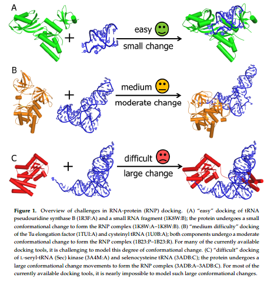
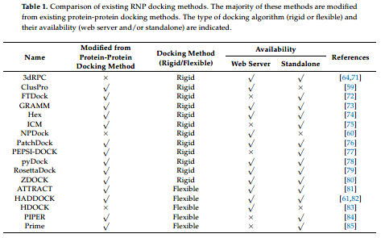
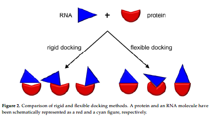
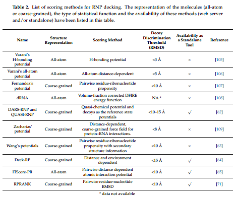
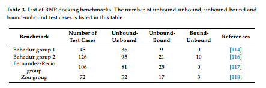
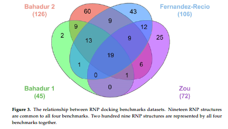
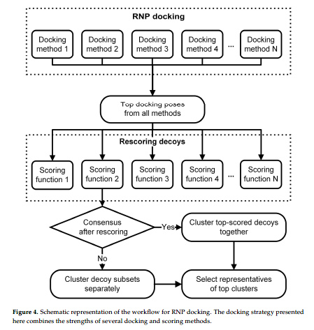

👏 分子对接|RNA-蛋白质对接和三维结构预测的工具和benchmarks

---
[TOC]

---
## 摘要
&emsp;&emsp;RNA-蛋白（RNP）互作在多种生物过程中发挥重要作用，例如基因转录表达调控、RNA剪切和蛋白合成等。然而实验方法确定RNP的高分辨率结构难度较大，所以涌现出来许多RNP互作预测的计算方法。这篇文章综述了RNP复合物三维结构预测的计算方法。

## 背景
&emsp;&emsp;已知的大多数RNA都会和蛋白形成RNP复合物在生命周期的一个或者多个阶段发挥重要作用。RNP涉及的细胞过程主要有染色体末端维持、转录、RNA转运、基因表达调控、蛋白合成、选择性剪接、RNA修饰和聚腺苷酸化。更重要的是，非编码RNA是大分子组装的骨架。因此RNP互作在细胞代谢中发挥非常重要的作用。

&emsp;&emsp;结合RNA的蛋白通常含有结构和功能两个不同的结构模块。例如，在所有作用于RNA的酶中，RNA结合是是催化结构域的公共特点。一些结构域可以自己结合RNA，另一些需要能够识别底物RNA的RNA结合结构域（RBDs）。RBDs主要有RNA识别模体（RRM）、KH、双链RNA结合模体（dsRBM）和锌指结合域。

&emsp;&emsp;RNA比蛋白的柔性更大，另外RNAs在形状上经常会伸长，因此难以形成稳定的晶胞结构，所以RNA和RNP的结构确证更加困难。这篇文章综述了RNP建模的计算方法，聚焦于RNP对接、打分函数以及数据集。

## RNP结构的计算建模
&emsp;&emsp;有实验结构的情况下用实验确证的蛋白受体结构以及RNA结构最为合适，没有实验结构时需要对受体蛋白和配体RNA的三维结构进行计算预测。

&emsp;&emsp;对接包括两个主要步骤：（1）构象采样；（2）对接姿势的打分。计算对接的主要挑战在于诱导契合效应，如下图所示。

## RNP对接方法
&emsp;&emsp;**衍生自蛋白蛋白对接方法的RNP对接方法。** 为了将蛋白蛋白对接应用至RNP对接中，下列步骤是必要的：（1）将RNA分子的表示加入到对接算法中。（2）打分函数评估RNA蛋白相互作用。目前已有的RNA蛋白对接方法如下表所示：

&emsp;&emsp;当前存在的对接方法分为两大类：刚性对接和柔性对接。如图2所示。刚性对接花费更少的计算资源并且能够探索更大的搜索空间从而确证RNA分子在蛋白上的结合位点，一般是首选的方法。柔性对接能够对构象变化较小或者局部微调的结构进行对接。实际上，目前没有任何方法能够准确可靠的预测具有较大构象变化的复合物结构。目前常用的柔性对接软件有HADDOCK和HDOCK。HADDOCK既可以使用核酸作为受体也可以作为配体。HDOCK仅能接受RNA结构文件作为输入，不能是序列。

## RNP复合物三维结构预测的其他方法
&emsp;&emsp;**基于复合物摸板的建模。** PRIME即是基于实验中确证的结构相似的复合物结构作为摸板进行RNP复合物建模。RStrucFam也是根据已有的RNP结构的序列相似性进行建模。  

&emsp;&emsp;**预测RNP复合物结构的另一种策略是MD模拟。** 可以将蛋白和RNA放在合适的力场中并加合适的限制从而模拟RNP的结合。例如ZDOCK软件。

&emsp;&emsp;M3框架使用多种实验数据对大分子RNP复合物进行建模。首先预测获得单结构域、单体和亚复合物的三维结构，然后将这些组分进行重排获得复合物的整体三维结构。例如IMP软件包和PyRy3D软件包。

## RNP复合物的打分函数
&emsp;&emsp;三维结构模型的打分可能基于下述几种考量：（1）打分函数对实验真实结构和诱饵结构的辨别能力。（2）蛋白RNA之间诱导契合质量的评估。当前已有的打分函数如下表2所示：

## RNA-蛋白三维结构基准数据集
&emsp;&emsp;如下表3和图3所示：

## 核酸-蛋白结合亲和力数据集

## 结论
&emsp;&emsp;为了获得生物、化学、物理等相关性质的预测，应该综合使用当前存在的多种对接和打分方法。如下图4所示，可以使用多种不同对接方法进行RNP对接并且挑选每种方法打分排名靠前的姿势。将这些姿势应用多种打分函数进行再打分。再打分之后挑选排名靠前的姿势进行后续的进一步分析，比如进行聚类。

&emsp;&emsp;RNP对接的最大的挑战就是分子的柔性以及柔性对接的计算复杂度。当前的刚性对接方法对RNP复合物结构打分相当准确，但是难以从起始的非结合结构计算生成建合的构象。一个可能的解决方法就是综合使用当前的多种对接方法以及打分函数对RNP结合构象进行合理评估。

## 参考文献
1. Nithin C, Ghosh P, Bujnicki J M. Bioinformatics tools and benchmarks for computational docking and 3D structure prediction of RNA-protein complexes[J]. Genes, 2018, 9(9): 432. [文献pdf](./分子对接RNA-蛋白质对接和三维结构预测的工具和benchmarks/genes-09-00432.pdf)