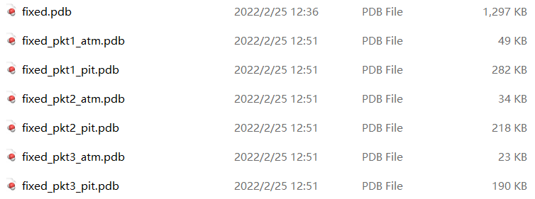

👏 分子对接|根据D3Pockets预测的蛋白口袋生成Smina对接的盒子参数文件

---
[TOC]

---
## D3Pockets计算蛋白口袋
计算结果如下图所示，其中的pit.pdb文件即是填充在口袋的格点文件，根据这些格点坐标最大最小值计算盒子中心以及尺寸。  
  

## 脚本
```python
import sys
import re

def generate_conf(pkt):
    x = []
    y = []
    z = []
    with open(pkt) as f:
        for line in f.readlines():
            x.append(float(line.strip()[-24:-16].strip()))
            y.append(float(line.strip()[-16:-8].strip()))
            z.append(float(line.strip()[-8:].strip()))
        centerx = (max(x)+min(x))/2
        centery = (max(y)+min(y))/2
        centerz = (max(z)+min(z))/2
        sizex = max(x) - min(x) + 5
        sizey = max(y) - min(y) + 5
        sizez = max(z) - min(z) + 5

    conf = open("conf.txt", "w")
    conf.write("center_x = " + str(int(centerx)) + "\n")
    conf.write("center_y = " + str(int(centery)) + "\n")
    conf.write("center_z = " + str(int(centerz)) + "\n")
    conf.write("size_x = " + str(int(sizex)) + "\n")
    conf.write("size_y = " + str(int(sizey)) + "\n")
    conf.write("size_z = " + str(int(sizez)) + "\n")
    conf.write("num_modes = 1\n")
    conf.write("exhaustiveness = 32")

def main():
    pkt = str(sys.argv[1])
    generate_conf(pkt)    

if __name__=="__main__":
    main()  
```