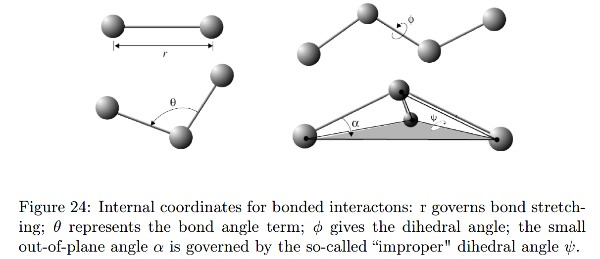
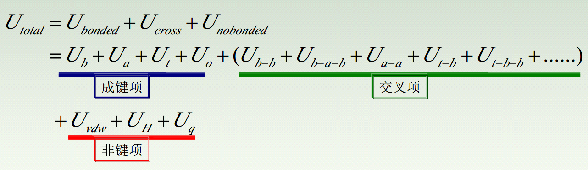
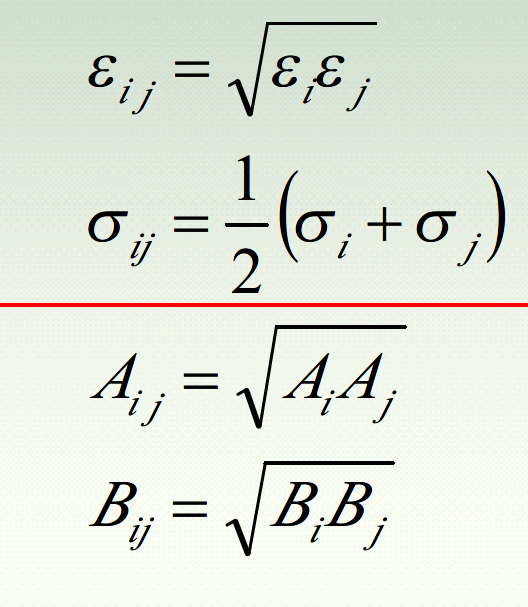

👏 分子模拟基础知识

---
[TOC]

---
## 分子模拟的优势
（1）降低试验成本
（2）具有较高安全性
（3）实现通常条件下较难或无法进行的试验
（4）研究过快或者过慢的反应
（5）从微观角度认知研究对象
（6）Give me an enough powerful computer, I can simulate the whole world.

## 分子模拟方法

## 分子力场
（1）根据量子力学的波恩-奥本海默近似，分子的能量可以近似看作构成分子的各个原子的空间坐标的函数，简单地讲就是分子的能量随分子构型的变化而变化，而描述这种分子能量和分子结构之间关系的就是分子力场(Force Field)函数。
（2）分子力场函数为来自实验结果的经验公式，可以讲对分子能量的模拟比较粗糙，但是相比于精确的量子力学从头计算方法，分子力场方法的计算量要小数十倍，而且在适当的范围内，分子力场方法的计算精度与量子化学计算相差无几，因此对大分子复杂体系而言，分子力场方法是一套行之有效的方法。
（3）分子力学、分子动力学、蒙特卡罗方法等就是以分子力场为基础的分子力学计算方法。
（4）分子力场函数由成键项$\ U_{bonded}$、交叉项$\ U_{cross}$和非键项$\ U_{nobonded}$三部分构成。即
$$U_{total} = U_{bonded} + U_{cross} + U_{nobonded}$$

### 成键项

成键项由键伸缩能$\ U_s$、键角弯曲能$\ U_a$、二面角扭曲能$\ U_t$和离平面振动能$\ U_o$四项组成。即
$$\ U_{bonded} = U_s + U_a + U_t + U_o$$
#### 键伸缩能
构成分子的各个化学键在键轴方向上的伸缩运动引起的能量变化。主要包括二次的简谐振动项，有的还包括一些非简谐振动项。如下所示：
$$\ U_s = \frac{1}{2}k(r-r_0)^2$$
$$\ U_s = k_2(r-r_0)^2 + k_3(r-r_0)^3 + k_4(r-r_0)^4$$

#### 键角弯曲能
键角变化引起的分子能量变化。
$$\ U_a = \frac{1}{2}k(\Theta-\Theta_0)^2$$
$$\ U_a = k_2(\Theta-\Theta_0)^2 + k_3(\Theta-\Theta_0)^3 + k_4(\Theta-\Theta_0)^4$$

#### 二面角扭曲能
单键旋转引起分子骨架扭曲所产生的能量变化。
$$\ U_t = \frac{1}{2}k(\varphi-\varphi_0)^2$$

#### 离平面振动能
共平面的四个原子中有一个原子偏离平面进行微小振动所引起的分子能量变化。
$$\ U_o = \frac{1}{2}c(cosw-cosw_0)$$

### 交叉能量项
**交叉能量项通常对整体的势能影响较小，一般的力场中不含有这些项，有较高要求时才有。交叉项形式复杂，计算非常耗时。**
|名称|缩写|公式|
|:----|:----|:----|
|键伸缩-键伸缩|$\ U_{b-b}$|$\ U_{b-b} = k(r_{12}-r_{120})(r_{13}-r_{130})$|
|键伸缩-键角弯曲-键伸缩|$\ U_{b-a-b}$|$\ U_{b-a-b} = (\Theta - \Theta_{0})[k_{12}(r_{12}-r_{120}) + k_{13}(r_{13}-r_{130})]$|
|键角弯曲-键角弯曲|$\ U_{a-a}$|$\ U_{a-a} = k(\Theta_{1}-\Theta_{10})(\Theta_{2}-\Theta_{20})$|
|二面角扭转项-键伸缩|$\ U_{t-b}$|$\ U_{t-b} = (r - r_{0})[V_1cos(n_1\varphi) + V_2cos(n_2\varphi) + V_3cos(n_3\varphi)]$|
|二面角扭转项-键角弯曲-键角弯曲|$\ U_{t-b-b}$|$\ U_{t-b-b} = k(\Theta_1 - \Theta_{10})(\Theta_2 - \Theta_{20})cos\varphi$|
|键角弯曲-二面角扭转项-键角弯曲|$\ U_{b-t-b}$|$\ U_{b-t-b} = (\Theta_1 - \Theta_{10})\sum\limits_{d} V_1cos(n_d\varphi) + (\Theta_2 - \Theta_{20})\sum\limits_{d} V_2cos(n_d\varphi)$|
|离平面振动-二面角扭转项-离平面振动|$\ U_{o-t-o}$|$\ U_{o-t-o} = (r_1 - r_{10})\sum\limits_{d} V_1cos(n_d\varphi) + (r_2 - r_{20})\sum\limits_{d} V_2cos(n_d\varphi)$|

### 非键相互作用
包括范德华作用、库伦静电作用和氢键作用等。

#### 范德华作用（短程）
通常LJ势函数更节省时间，但是Morse和Buckingham更准确。
|名称|表达式|
|:----|:----|
|Lennard-Jones(m,n)|$U_{vdw} = \epsilon [\frac{n}{m-n}(\frac{\sigma}{r})^m - \frac{m}{m-n}(\frac{\sigma}{r})^n] $|
|Lennard-Jones|$U_{vdw} = \frac{A}{r^m} - \frac{B}{r^n}$|
|Buckingham|$U_{vdw} = Ae^{-\frac{r}{\rho}} - \frac{C}{r^6}$|
|Morse|$U_{vdw} = D_0\{[1-e^{-a(r-r_0)}]^2 - 1\}$|

#### 库伦作用
$$U_q = \frac{q_1q_2}{4\pi\epsilon_0r_{ij}}$$

#### 氢键作用
（1）对于X-H···Y这个结构，说氢键的距离是指X-Y间的距离。
（2）对于反应中氢键断裂所需的能量称为氢键的键能，这时指H-Y之间的能量。
$$U_H = (\frac{A}{r^m} - \frac{B}{r^n})(cos\Theta)^p$$

### 总结

### 力场函数中需要注意的几个问题
（1）LJ势能的结合原则
举例说明:水和甲醇混合液中的vdw类型：

（2）vdw作用和库伦作用的排除
同一分子中，成键原子间的VDW作用和库伦作用已经被包含在成键项中，因此不需要在计算这两个作用时重新被计算，即需要扣除它们。
（3）力场函数中参数的获得
实验观测的数据；量子力学计算的数据
（4）力场函数的选择原则

### 常见力场
|名称|说明|适用范围|优缺点|
|:----|:----|:----|:----|
|MM力场|MM力场将一些常见的原子细分，如碳原子分为sp3、sp2、sp、酮基碳、碳阳离子等形态，不同的形态有不同的力场参数。|适合各种有机化合物、自由基、离子。MM力场可以得到十分准确的构型、能量、热力学性质、振动光谱等。|结果精确，主要就是由于考虑了交叉项，但形势复杂，不易程序化，计算比较费时。|
|AMBER力场|美国加州大学的Peter Kollman建立。|适用于较小的蛋白质、核酸、多糖等生化分子。应用此力场可以得到合理的气态分子结构、能量、振动频率与溶剂化自由能。AMBER力场的所有参数全部来自实验值。||
|CHARMM力场|美国哈佛大学建立。力场参数除引用实验参数结果外，还引入了大量的量子力学计算结果。|力场可以研究许多分子系统，包括小的有机分子、溶液、聚合物和生化分子等。|除了有机金属分子外，此力场可以得到与实验值相近的结构、能量振动频率等。|
