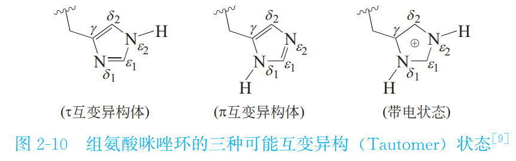

👏 动力学模拟中的质子化状态等相关问题

---
[TOC]

---
## H++预测蛋白质子化状态
网站：http://newbiophysics.cs.vt.edu/H++/
账号：yqyang   密码：yyq3month2

## 组氨酸质子化状态
His的咪唑环的pKa 值约为6,存在互变异构现象,在接近生理pH 值下,因局部环境变化,可以呈中性或带一单位正电荷。因咪唑环能结合和释放质子,因此 His常出现在酶催化反应的活性位点。如下图所示：（来源：药物设计学-唐赟）
