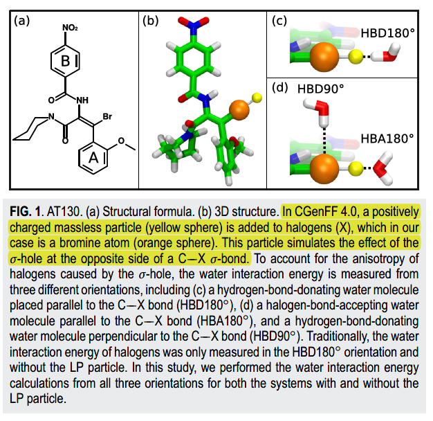

👏 含卤素原子的分子动力学模拟

---
[TOC]

---
[Parameterization of a drug molecule with a halogen σ-hole particle using ffTK: Implementation, testing, and comparison](./含卤素原子的分子动力学模拟/pang2020.pdf)
CGenFF在处理含卤素（氯，溴和碘）的配体时会在原子上增加一个无质量但带有正电的离子来模仿σ-hole效应。如下所示：

[Real-space imaging of anisotropic charge of s-hole by means of Kelvin probe force microscopy](./含卤素原子的分子动力学模拟/science.abk1479.pdf)
实验上对卤素原子σ-hole进行了可视化。如下：

