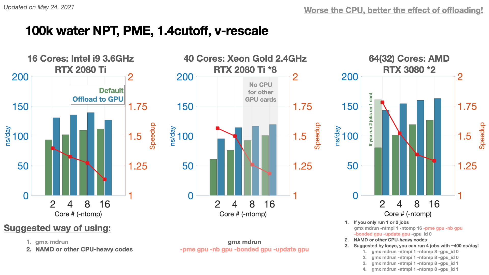
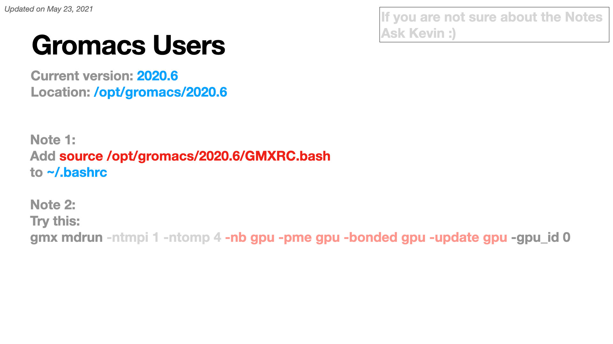
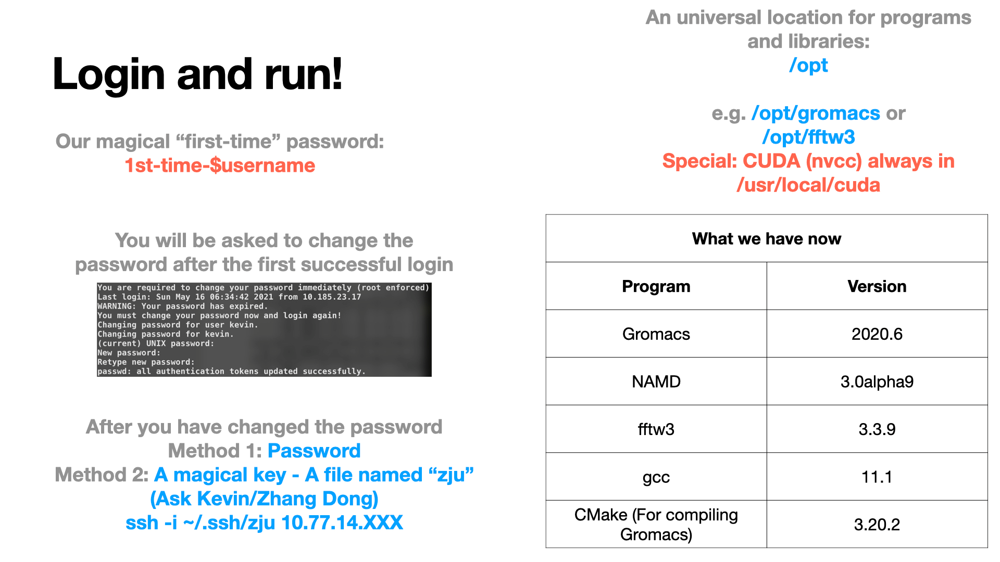
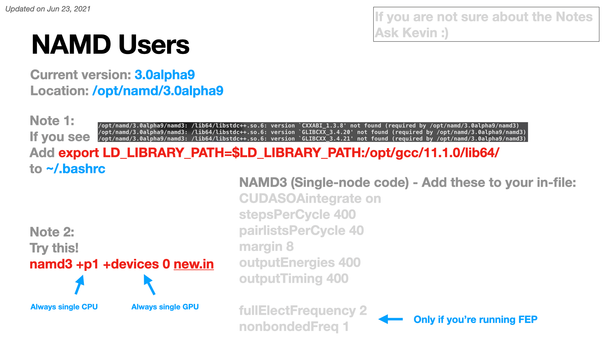
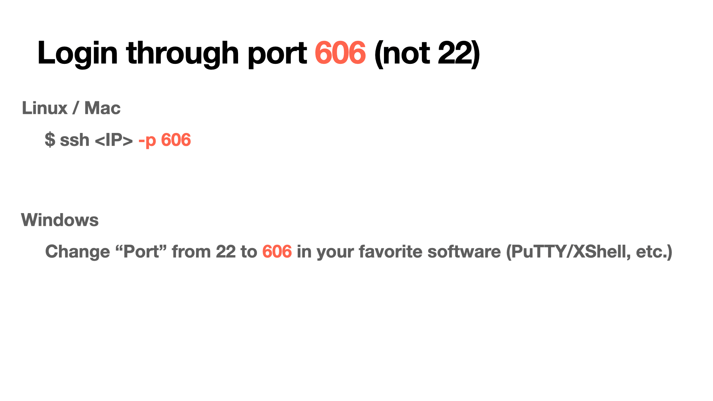
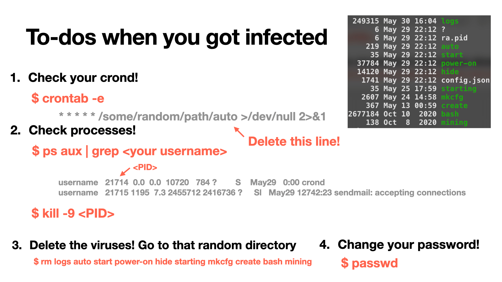
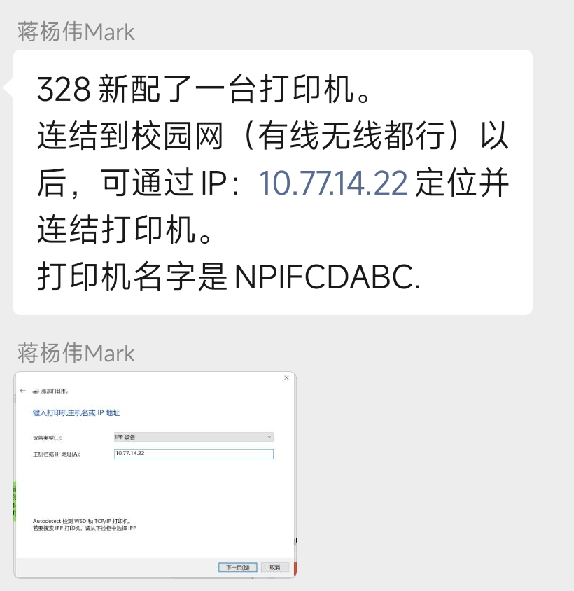

👏 浙大定量生物中心服务器任务提交

---
[TOC]

---
## CPU集群27
[.bashrc](./浙大定量生物中心服务器任务提交/.bashrc)
[gromacs.pbs](./浙大定量生物中心服务器任务提交/gromacs.pbs)
[namd.pbs](./浙大定量生物中心服务器任务提交/namd.pbs)
[27集群使用说明](./浙大定量生物中心服务器任务提交/27集群使用说明.txt)
yqyang账户下的软件：破解版的Maestro

## GPU集群28
[fep.pbs](./浙大定量生物中心服务器任务提交/fep.pbs)
[md.pbs](./浙大定量生物中心服务器任务提交/md.pbs)
yqyang账户下的软件：学术版的Desmond

## Machines

## 打印机

## 浙定28服务器配置
gcc: /bin/gcc
g++: /bin/g++