👏 深度学习|VAE详解

---
[TOC]

---
## 概率与统计
概率和统计概念相近，但是研究的问题恰好相反。**概率研究的问题是，已知一个模型和参数，怎么去预测这个模型产生的结果的特性（例如均值，方差，协方差等等）。统计研究的问题则是有一堆数据，要利用这堆数据去预测模型和参数。一句话总结：概率是已知模型和参数，推数据。统计是已知数据，推模型和参数。**

## VAE的动机

## AE与VAE比较
自编码器(AE)并不具有真正的生成能力，以图像为例来说，它只能将输入的图像编码成隐向量，然后将作为解码器的输入，得到输出图像。如果我们尝试将与输入图像shape一致的"随机特征表示"输入解码器，那么得到的将是毫无意义的噪声图像。
**在VAE中，只要随机特征表示服从某些分布，如标准正态分布中采样得到的，那么将输入解码器之后可以得到与训练集图像类似但不同于训练集中任何一张图像的新图像。**
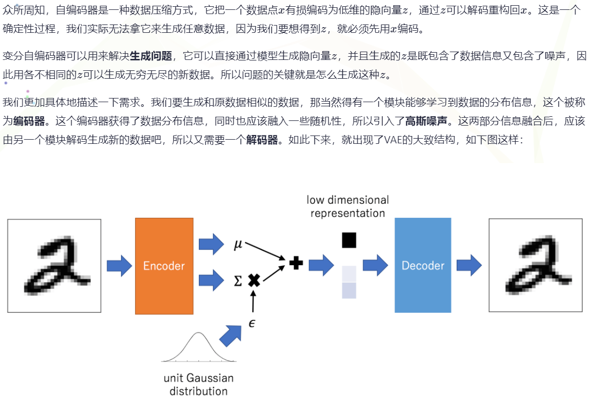

## 贝叶斯公式
**贝叶斯公式就是在描述，你有多大把握能相信一件证据？（how much you can trust the evidence）。贝叶斯公式的分母是全概率公式，告诉我们做判断的时候，要考虑所有的因素。**
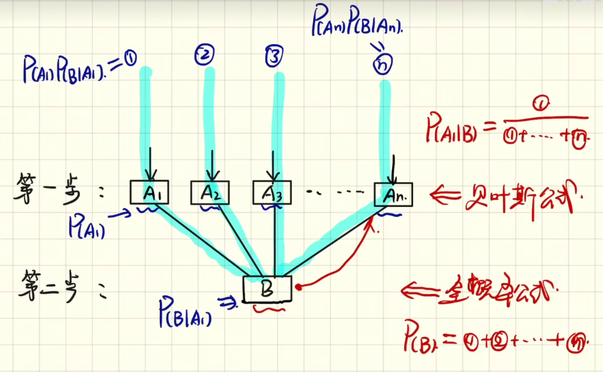
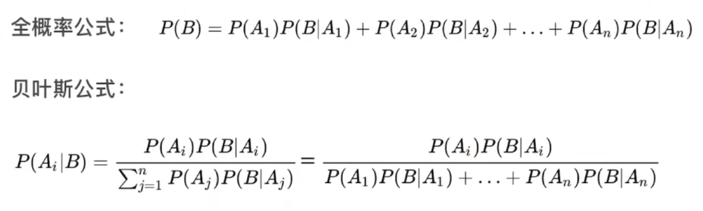
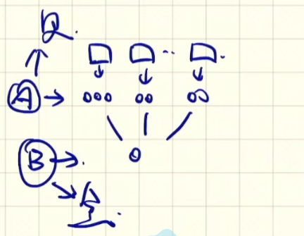

**参考资料**
1. [「一个模型」教你搞定贝叶斯和全概率公式](https://www.bilibili.com/video/BV1a4411B7B4/?from=search&seid=4568516296802349710&vd_source=85aa5c7a4e0e5230f6f0f254cff40367)

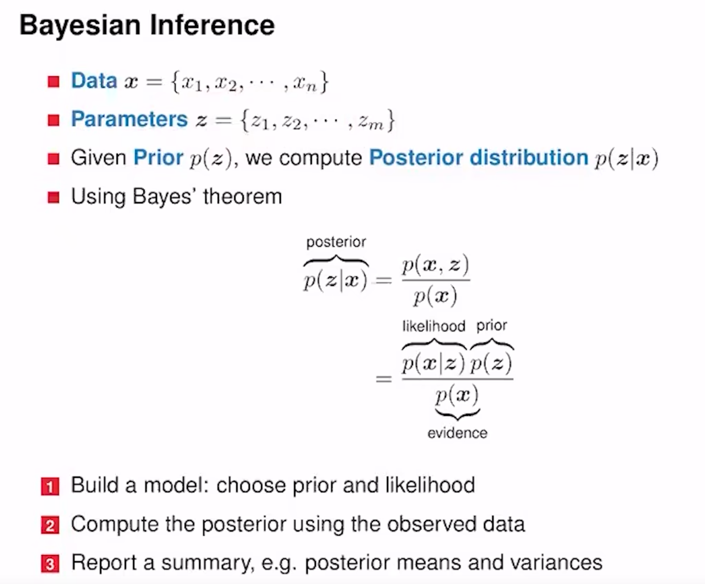
x是已知的数据集，z是最终想要学习得到的参数。目的是想根据已有的数据x对参数z进行更新修订。即想求的是p(z|x)。p(x)是真实的x的分布，可对参数z进行积分求出。p(z)是提前假定的一个符合一定分布的参数也是已知的，后面可以根据输入的真实数据X进行不断的调整。p(x|z)则可以根据p(x)和p(z)进行计算求出。由前三者计算即可得到由数据x更新得到的新的p(z)，即p(z|x)。

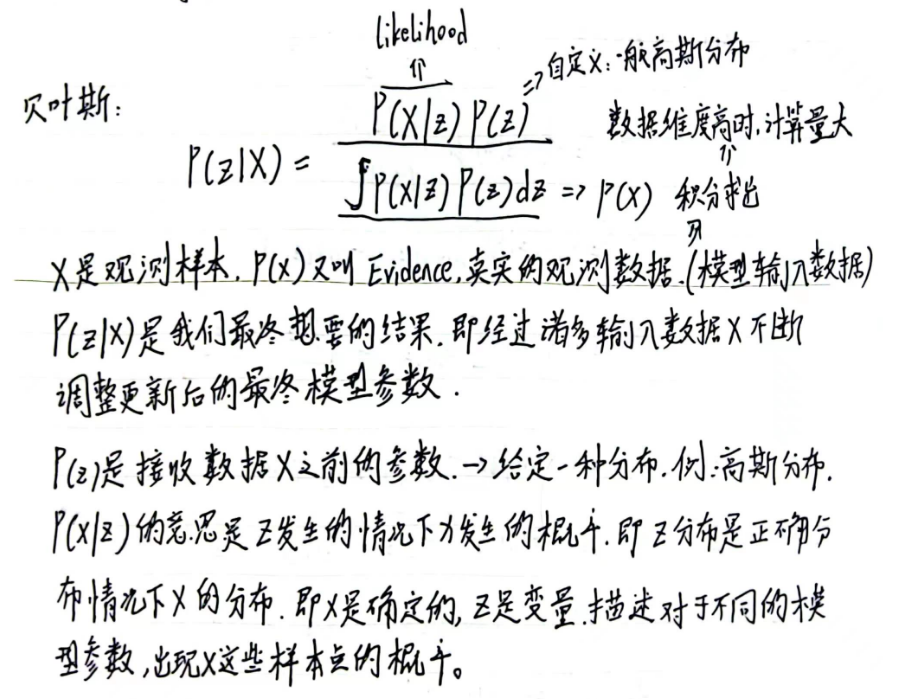

## 似然函数和似然估计
### 似然函数
对于函数$P(x|\theta)$，x是观测的样本数据，$\theta$ 是模型的参数。
如果 $\theta$ 是已知确定的，$x$ 是变量，这个函数叫做概率函数，它描述对于不同的样本点 $x$，其出现概率是多少。如果 $x$ 是已知确定的，$\theta$ 是变量，这个函数叫做似然函数(likelihood function), 它描述对于不同的模型参数，出现x这个样本点的概率是多少。

### 最大似然估计
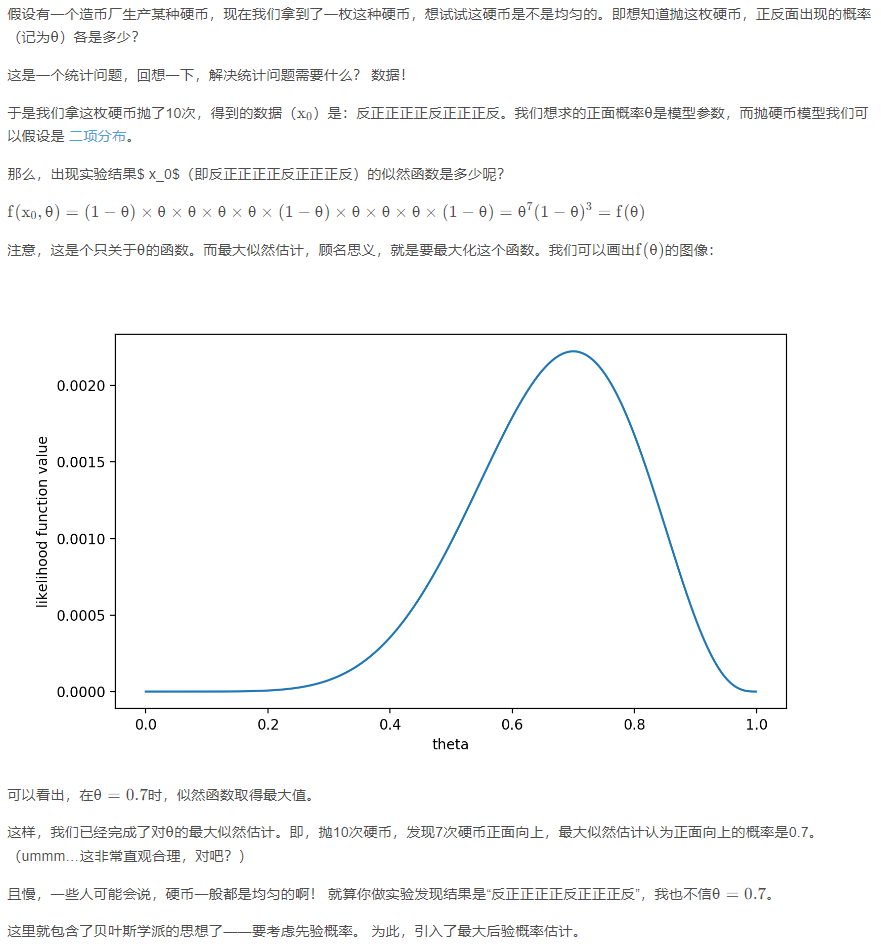

**参考资料**
1. [详解最大似然估计（MLE）、最大后验概率估计（MAP），以及贝叶斯公式的理解](https://blog.csdn.net/u011508640/article/details/72815981/)

## 变分理论
**将上述贝叶斯的计算问题转换为一个优化问题。**
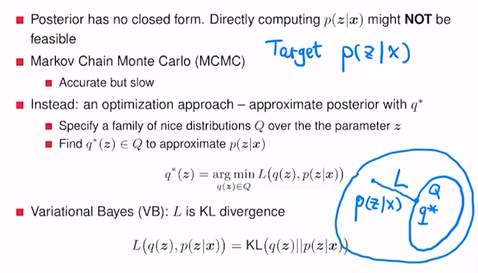

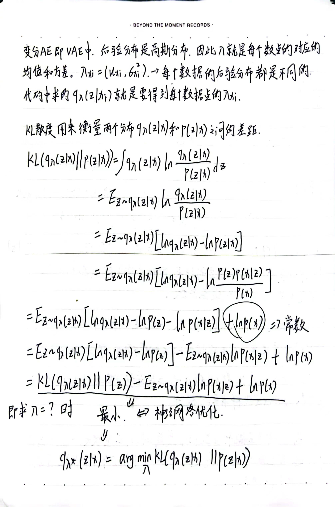
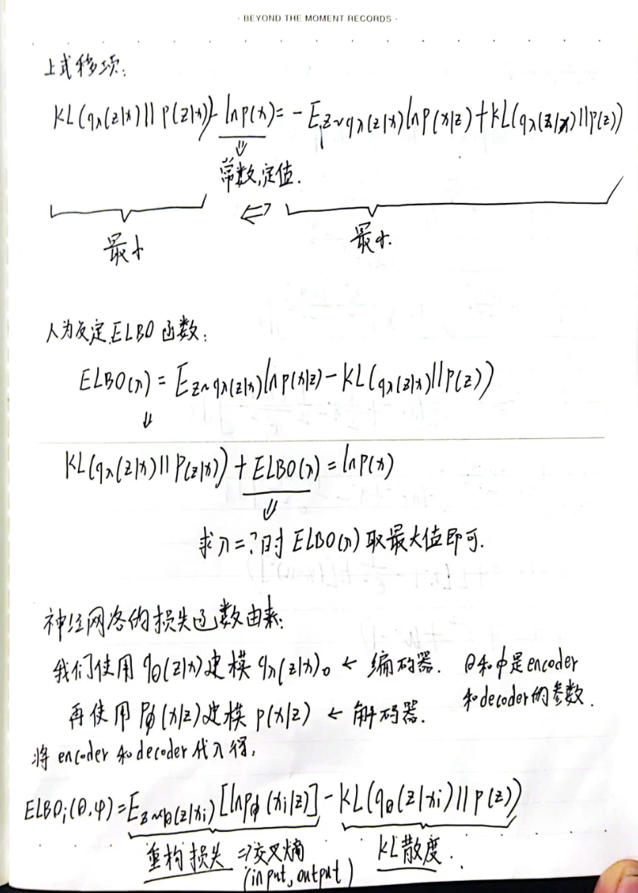
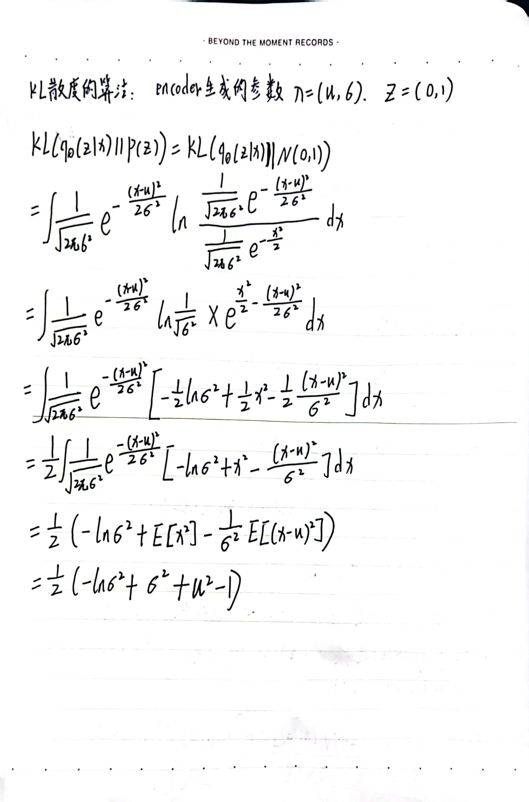

**参考资料**
1. [变分自编码器VAE原理](https://www.cnblogs.com/weilonghu/p/12567793.html)

## Code
* [PyTorch VAE](https://github.com/AntixK/PyTorch-VAE)