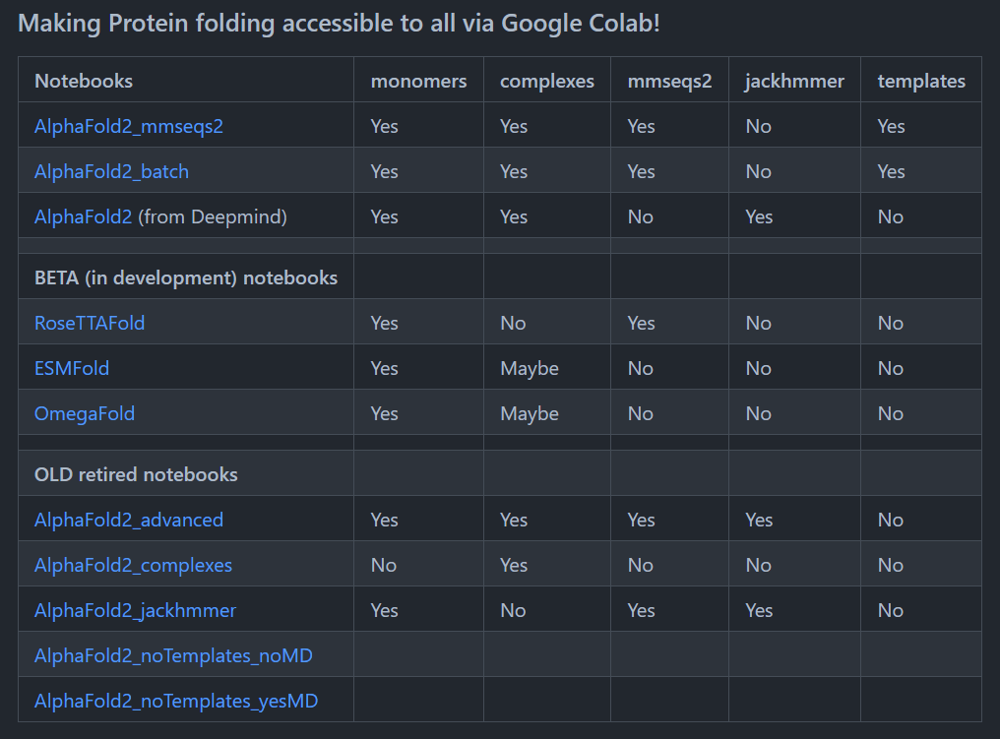

👏 蛋白同源建模

---
[TOC]

---

## 复合物建模
### D3PM
网站：https://seq2fun.dcmb.med.umich.edu/DMFold/


### Colab
总网站：https://github.com/sokrypton/ColabFold

网站：https://colab.research.google.com/github/sokrypton/ColabFold/blob/main/AlphaFold2.ipynb

### 安装官网教程
参考：https://github.com/YoshitakaMo/localcolabfold
1. Make sure `curl`, `git`, and `wget` commands are already installed on your PC. If not present, you need install them at first. For Ubuntu, type `sudo apt -y install curl git wget`.
2. Make sure your Cuda compiler driver is **11.1 or later** (If you don't have a GPU or don't plan to use a GPU, you can skip this section) :<pre>$ nvcc --version
nvcc: NVIDIA (R) Cuda compiler driver
Copyright (c) 2005-2020 NVIDIA Corporation
Built on Mon_Oct_12_20:09:46_PDT_2020
Cuda compilation tools, release 11.1, V11.1.105
Build cuda_11.1.TC455_06.29190527_0
</pre>DO NOT use `nvidia-smi` to check the version.<br>See [NVIDIA CUDA Installation Guide for Linux](https://docs.nvidia.com/cuda/cuda-installation-guide-linux/index.html) if you haven't installed it.
3. Make sure your GNU compiler version is **4.9 or later** because `GLIBCXX_3.4.20` is required:<pre>$ gcc --version
gcc (Ubuntu 9.3.0-17ubuntu1~20.04) 9.3.0
Copyright (C) 2019 Free Software Foundation, Inc.
This is free software; see the source for copying conditions.  There is NO
warranty; not even for MERCHANTABILITY or FITNESS FOR A PARTICULAR PURPOSE.
</pre>If the version is 4.8.5 or older (e.g. CentOS 7), install a new one and add `PATH` to it.
4. Download `install_colabbatch_linux.sh` from this repository:<pre>$ wget https://raw.githubusercontent.com/YoshitakaMo/localcolabfold/main/install_colabbatch_linux.sh</pre> and run it in the directory where you want to install:<pre>$ bash install_colabbatch_linux.sh</pre>About 5 minutes later, `colabfold_batch` directory will be created. Do not move this directory after the installation.

    Keep the network unblocked. And **check the log** output to see if there are any errors.

    If you find errors in the output log, the easiest way is to check the network and delete the colabfold_batch directory, then re-run the installation script.

5. Add environment variable PATH:<pre># For bash or zsh<br># e.g. export PATH="/home/moriwaki/Desktop/colabfold_batch/colabfold-conda/bin:\$PATH"<br>export PATH="<COLABFOLDBATCH_DIR>/bin:\$PATH"</pre>
It is recommended to add this export command to `~/.bashrc` and restart bash (`~/.bashrc` will be executed every time bash is started)

6. To run the prediction, type <pre>colabfold_batch input outputdir/</pre>The result files will be created in the `outputdir`. This command will execute the prediction without templates and relaxation (energy minimization). If you want to use templates and relaxation, add `--templates` and `--amber` flags, respectively. For example,

    <pre>colabfold_batch --templates --amber input outputdir/</pre>

    To run the AlphaFold2-multimer with the versioned AF2-multimer weights, add `--model-type alphafold2_multimer_v3` in the arguments. e.g. <pre>colabfold_batch --templates --amber --model-type alphafold2_multimer_v3 input outputdir/</pre>`alphafold2_multimer_v1, alphafold2_multimer_v2` are also available. Default is `auto` (use `alphafold2_ptm` for monomers and `alphafold2_multimer_v3` for complexes.)

For more details, see [Flags](#flags) and `colabfold_batch --help`.

### 自己安装教程
**参考网上colabfold的运行逻辑进行安装运行。**
（0）安装合适版本的 CUDA 和 gcc
（1）安装 miniconda
（2）创建 colabfold 环境并安装 python3.9
```python
conda create --name colabfold python=3.9
``` 
（3）在 colabfold 环境下将下述 colabfold 文件夹和 alphafold 文件夹和存放模型的 params 文件夹放在随机一个工作目录下：params 中模型参数信息自行下载。
[colabfold](蛋白同源建模/colabfold/)
[alphafold](蛋白同源建模/alphafold/)
执行下述1.py文件
```python
import os
import re
import hashlib
import random

from sys import version_info
python_version = f"{version_info.major}.{version_info.minor}"

def add_hash(x,y):
  return x+"_"+hashlib.sha1(y.encode()).hexdigest()[:5]

query_sequence = 'DFPSCRCVEQIIEKDEGPFYTHLGAGPNVAAIREIMEERFGQKGKAIRIERVIYTGKEGKSSQGCPIAKWVVRRSSSEEKLLCLVRERAGHTCEAAVIVILILVWEGIPLSLADKLYSELTETLRKYGTLTNRRCALNEERTCACQGLDPETCGASFSFGCSWSMYYNGCKFARSKIPRKFKLLGDDPKEEEKLESHLQNLSTLMAPTYKKLAPDAYNNQIEYEHRAPECRLGLKEGRPFSGVTACLDFCAHAHRDLHNMQNGSTLVCTLTREDNREFGGKPEDEQLHVLPLYKVSDVDEFGSVEAQEEKKRSGAIQVLSSFRRKVRMLAEPVKTC:DNDEVWSDSEQSFLDPDIGGVAVAPTHGSILIECAKRELHATTPLKNPNRNHPTRISLVFYQHKSMNEPKHGLALWEAKM' #@param {type:"string"}
#@markdown  - Use `:` to specify inter-protein chainbreaks for **modeling complexes** (supports homo- and hetro-oligomers). For example **PI...SK:PI...SK** for a homodimer
jobname = 'mlj' #@param {type:"string"}
# number of models to use
num_relax = 5 #@param [0, 1, 5] {type:"raw"}
#@markdown - specify how many of the top ranked structures to relax using amber
template_mode = "none" #@param ["none", "pdb70","custom"]
#@markdown - `none` = no template information is used. `pdb70` = detect templates in pdb70. `custom` - upload and search own templates (PDB or mmCIF format, see [notes below](#custom_templates))

use_amber = num_relax > 0

# remove whitespaces
query_sequence = "".join(query_sequence.split())

basejobname = "".join(jobname.split())
basejobname = re.sub(r'\W+', '', basejobname)
jobname = add_hash(basejobname, query_sequence)


# check if directory with jobname exists
def check(folder):
  if os.path.exists(folder):
    return False
  else:
    return True
if not check(jobname):
  n = 0
  while not check(f"{jobname}_{n}"): n += 1
  jobname = f"{jobname}_{n}"

# make directory to save results
os.makedirs(jobname, exist_ok=True)

# save queries
queries_path = os.path.join(jobname, f"{jobname}.csv")
with open(queries_path, "w") as text_file:
  text_file.write(f"id,sequence\n{jobname},{query_sequence}")

if template_mode == "pdb70":
  use_templates = True
  custom_template_path = None
elif template_mode == "custom":
  custom_template_path = os.path.join(jobname,f"template")
  os.makedirs(custom_template_path, exist_ok=True)
  uploaded = files.upload()
  use_templates = True
  for fn in uploaded.keys():
    os.rename(fn,os.path.join(custom_template_path,fn))
else:
  custom_template_path = None
  use_templates = False

print("jobname",jobname)
print("sequence",query_sequence)
print("length",len(query_sequence.replace(":","")))

#@markdown ### MSA options (custom MSA upload, single sequence, pairing mode)
msa_mode = "mmseqs2_uniref_env" #@param ["mmseqs2_uniref_env", "mmseqs2_uniref","single_sequence","custom"]
pair_mode = "unpaired_paired" #@param ["unpaired_paired","paired","unpaired"] {type:"string"}
#@markdown - "unpaired_paired" = pair sequences from same species + unpaired MSA, "unpaired" = seperate MSA for each chain, "paired" - only use paired sequences.

# decide which a3m to use
if "mmseqs2" in msa_mode:
  a3m_file = os.path.join(jobname,f"{jobname}.a3m")

elif msa_mode == "custom":
  a3m_file = os.path.join(jobname,f"{jobname}.custom.a3m")
  if not os.path.isfile(a3m_file):
    custom_msa_dict = files.upload()
    custom_msa = list(custom_msa_dict.keys())[0]
    header = 0
    import fileinput
    for line in fileinput.FileInput(custom_msa,inplace=1):
      if line.startswith(">"):
         header = header + 1
      if not line.rstrip():
        continue
      if line.startswith(">") == False and header == 1:
         query_sequence = line.rstrip()
      print(line, end='')

    os.rename(custom_msa, a3m_file)
    queries_path=a3m_file
    print(f"moving {custom_msa} to {a3m_file}")

else:
  a3m_file = os.path.join(jobname,f"{jobname}.single_sequence.a3m")
  with open(a3m_file, "w") as text_file:
    text_file.write(">1\n%s" % query_sequence)

#@markdown ### Advanced settings
model_type = "auto" #@param ["auto", "alphafold2_ptm", "alphafold2_multimer_v1", "alphafold2_multimer_v2", "alphafold2_multimer_v3"]
#@markdown - if `auto` selected, will use `alphafold2_ptm` for monomer prediction and `alphafold2_multimer_v3` for complex prediction.
#@markdown Any of the mode_types can be used (regardless if input is monomer or complex).
num_recycles = "auto" #@param ["auto", "0", "1", "3", "6", "12", "24", "48"]
recycle_early_stop_tolerance = "auto" #@param ["auto", "0.0", "0.5", "1.0"]
#@markdown - if `auto` selected, will use 20 recycles if `model_type=alphafold2_multimer_v3` (with tol=0.5), all else 3 recycles (with tol=0.0).

#@markdown #### Sample settings
#@markdown -  enable dropouts and increase number of seeds to sample predictions from uncertainty of the model.
#@markdown -  decrease `max_msa` to increase uncertainity
max_msa = "auto" #@param ["auto", "512:1024", "256:512", "64:128", "32:64", "16:32"]
num_seeds = 1 #@param [1,2,4,8,16] {type:"raw"}
use_dropout = False #@param {type:"boolean"}

num_recycles = None if num_recycles == "auto" else int(num_recycles)
recycle_early_stop_tolerance = None if recycle_early_stop_tolerance == "auto" else float(recycle_early_stop_tolerance)
if max_msa == "auto": max_msa = None

#@markdown #### Save settings
save_all = False #@param {type:"boolean"}
save_recycles = False #@param {type:"boolean"}
save_to_google_drive = False #@param {type:"boolean"}
#@markdown -  if the save_to_google_drive option was selected, the result zip will be uploaded to your Google Drive
dpi = 200 #@param {type:"integer"}
#@markdown - set dpi for image resolution

if save_to_google_drive:
  from pydrive.drive import GoogleDrive
  from pydrive.auth import GoogleAuth
  from google.colab import auth
  from oauth2client.client import GoogleCredentials
  auth.authenticate_user()
  gauth = GoogleAuth()
  gauth.credentials = GoogleCredentials.get_application_default()
  drive = GoogleDrive(gauth)
  print("You are logged into Google Drive and are good to go!")

#@markdown Don't forget to hit `Runtime` -> `Run all` after updating the form.

#@title Run Prediction
display_images = True #@param {type:"boolean"}

import sys
import warnings
warnings.simplefilter(action='ignore', category=FutureWarning)
from Bio import BiopythonDeprecationWarning
warnings.simplefilter(action='ignore', category=BiopythonDeprecationWarning)
from pathlib import Path
from colabfold.download import download_alphafold_params, default_data_dir
from colabfold.utils import setup_logging
from colabfold.batch import get_queries, run, set_model_type
from colabfold.plot import plot_msa_v2

import os
import numpy as np
try:
  K80_chk = os.popen('nvidia-smi | grep "Tesla K80" | wc -l').read()
except:
  K80_chk = "0"
  pass
if "1" in K80_chk:
  print("WARNING: found GPU Tesla K80: limited to total length < 1000")
  if "TF_FORCE_UNIFIED_MEMORY" in os.environ:
    del os.environ["TF_FORCE_UNIFIED_MEMORY"]
  if "XLA_PYTHON_CLIENT_MEM_FRACTION" in os.environ:
    del os.environ["XLA_PYTHON_CLIENT_MEM_FRACTION"]

from colabfold.colabfold import plot_protein
from pathlib import Path
import matplotlib.pyplot as plt

# For some reason we need that to get pdbfixer to import
if use_amber and f"/usr/local/lib/python{python_version}/site-packages/" not in sys.path:
    sys.path.insert(0, f"/usr/local/lib/python{python_version}/site-packages/")

def input_features_callback(input_features):
  if display_images:
    plot_msa_v2(input_features)
    plt.show()
    plt.close()

def prediction_callback(protein_obj, length,
                        prediction_result, input_features, mode):
  model_name, relaxed = mode
  if not relaxed:
    if display_images:
      fig = plot_protein(protein_obj, Ls=length, dpi=150)
      plt.show()
      plt.close()

result_dir = jobname
if 'logging_setup' not in globals():
    setup_logging(Path(os.path.join(jobname,"log.txt")))
    logging_setup = True

queries, is_complex = get_queries(queries_path)
model_type = set_model_type(is_complex, model_type)

if "multimer" in model_type and max_msa is not None:
  use_cluster_profile = False
else:
  use_cluster_profile = True

#download_alphafold_params(model_type, Path("."))
results = run(
    queries=queries,
    result_dir=result_dir,
    use_templates=use_templates,
    custom_template_path=custom_template_path,
    num_relax=num_relax,
    msa_mode=msa_mode,
    model_type=model_type,
    num_models=5,
    num_recycles=num_recycles,
    recycle_early_stop_tolerance=recycle_early_stop_tolerance,
    num_seeds=num_seeds,
    use_dropout=use_dropout,
    model_order=[1,2,3,4,5],
    is_complex=is_complex,
    data_dir=Path("."),
    keep_existing_results=False,
    rank_by="auto",
    pair_mode=pair_mode,
    stop_at_score=float(100),
    prediction_callback=prediction_callback,
    dpi=dpi,
    zip_results=False,
    save_all=save_all,
    max_msa=max_msa,
    use_cluster_profile=use_cluster_profile,
    input_features_callback=input_features_callback,
    save_recycles=save_recycles,
)
results_zip = f"{jobname}.result.zip"
os.system(f"zip -r {results_zip} {jobname}")
```
在执行上述脚本时会提示一些包没有安装，按照提示进行依次安装即可。**注意：jax, jaxlib 和 haiku 采用下述文件夹的内容。将这3个文件夹复制进/home/yqyang/software/miniconda3-1/envs/colabfold/lib/python3.9/site-packages即可。**
[jax](蛋白同源建模/jax/)
[jaxlib](蛋白同源建模/jaxlib/)
[haiku](蛋白同源建模/haiku/)
其他的部分软件包安装命令如下所示：
```shell
conda install -c conda-forge biopython
conda install appdirs
conda install tqdm
conda install absl-py
conda install -c conda-forge importlib_metadata
conda install pandas
conda install dm-tree
conda install scikit-learn
conda install matplotlib
conda install requests
conda install ml_collections   /   pip install ml-collections
conda install -c conda-forge openmm
conda install -c conda-forge pdbfixer
conda install tensorflow-gpu
```
（4）使用本地 colabfold 进行本地蛋白复合物预测。
- 进入网页版的colab：https://github.com/yqyang733/ColabFold
- 依次运行 Run Prediction 之前的所有单元格
- 将网上 colabfold 文件夹中的 batch.py 删除。
- 上传下述 batch.py 至  colabfold 文件夹中。
[batch.py](蛋白同源建模/batch.py)

（5）在 colab 网上运行 Run Prediction。在序列比对完成之后会生成一个 template_features.pkl 文件。将 template_features.pkl 文件上传至本地 colabfold 的工作目录下。并且修改1.py中的序列以及任务名称，运行下述命令进行预测即可：
```python
python 1.py
```
（6）测试
测试742个氨基酸，从提交到得到5个relaxed的结构，一共需要1.5-2小时。

## 参考文献
1. Jumper J, Evans R, Pritzel A, et al. Highly accurate protein structure prediction with AlphaFold. Nature, 2021, 596: 583-589. doi: 10.1038/s41586-021-03819-2.  

## Alphafold2
* AlphaFold2 and its applications in the fields of biology and medicine
