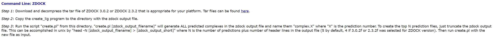

👏 蛋白多肽对接

---
[TOC]

---
## alphafold2
Tsaban T, Varga JK, Avraham O, Ben-Aharon Z, Khramushin A, Schueler-Furman O. Harnessing protein folding neural networks for peptide-protein docking. Nat Commun. 2022, 13: 176. doi: 10.1038/s41467-021-27838-9. [pdf](./蛋白多肽对接/s41467-021-27838-9.pdf) 

## 

## HPEPDOCK 2.0
网站：http://huanglab.phys.hust.edu.cn/hpepdock/

## pepATTRACT 2.0
网站：https://mobyle.rpbs.univ-paris-diderot.fr/cgi-bin/portal.py#forms::pepATTRACT
账号：yanqyang@zju.edu.cn   密码：yyq3month28day

## ZDOCK
网站：https://zdock.umassmed.edu/
（1）下载ZDOCK对接产生的所有结果。如下图教程所示：

从 https://zdock.umassmed.edu/software/ 下载压缩软件包，上传至linux中解压缩，从ZDOCK结果网站上下载 rec.job324807.bl.pdb，lig.job324807.bl.pdb和job.324807.zd3.0.2.out 文件。上述文件均放置在同一文件夹下运行 ./create.pl job.324807.zd3.0.2.out 即可下载所有对接结果文件。

## MDockPeP
网站：https://zougrouptoolkit.missouri.edu/mdockpep/

## CABS-dock
网站：http://biocomp.chem.uw.edu.pl/CABSdock

## HawkDock
网站：http://cadd.zju.edu.cn/hawkdock/

## Cluspro
网站：https://cluspro.bu.edu/
username: yqyang     password: 4GsdqY2y

## CoDockPP
网站：http://codockpp.schanglab.org.cn/index.php

## 蛋白多肽对接的综述性文章
1. Protein–peptide docking: opportunities and challenges. [2018 pdf](./蛋白多肽对接/Protein–peptide_docking_opportunities_and_challenges.pdf)
2. Comprehensive Evaluation of Fourteen Docking Programs on Protein−Peptide Complexes. [2020 pdf](./蛋白多肽对接/acs.jctc.9b01208.pdf)
