👏 蛋白小分子计算完整流程培训

---
[TOC]

---
[课件-杨延青](蛋白小分子计算完整流程培训/组内培训-小分子_yqyang_20230514.pptx)  
[课件-Leili](蛋白小分子计算完整流程培训/SmallMolFEP_Dec2022_ZJU-short.pptx)  
[课件-gxf](蛋白小分子计算完整流程培训/handout-smallMolFEP-practical.pdf)  
[FEbuilder](蛋白小分子计算完整流程培训/FEbuilder/)

# 小分子NAMD-fep培训讲义-高旭帆

> 作者：高旭帆
>
> 时间：2023年5月14日

## 说明

~~想要随堂练习的同学，请提前做好以下准备：~~

- ~~从27服务器拷贝本讲义所用文件至**本地**~~
  - 用户名：`iqbstudy`
  - 位置：`~/xufan/FEP-tutorial`
- ~~提前安装pymol或其他能进行可视化、编辑小分子pdb文件的工具，安装一个好用的文本编辑器~~
- ~~提前在CHARMM-GUI上注册好账号，确保能访问 https://www.charmm-gui.org/?doc=input/ligandrm~~
- ~~小分子FEP自动搭建程序（自编，下称“FEbuilder”）在本次培训中只演示一遍，不用跟着做。~~

大纲

1. 引言
2. 案例一：力场中有的分子
3. 案例二：一般小分子
4. 自编程序FEbuilder的使用
5. 讨论

本讲义主要针对实操，包含所有步骤和说明。有任何操作上的问题请随时打断；其他进阶问题最后集中讨论。本讲义已经发到群里供参考，自编程序FEbuilder的代码在27公共账号（`~/xufan/FEbuilder`），`~/xufan/FEbuilder/docs/build/html/index.html`有一个很初步的文档。如有更多问题请私下联系我。

## 引言

### 小分子的多样性

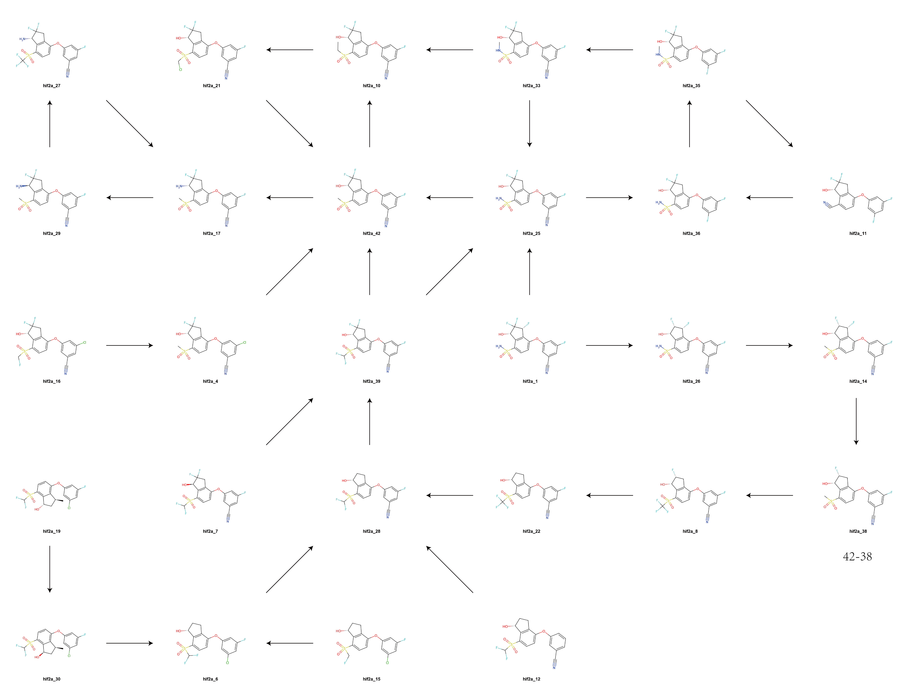

每个FEP都需要自己构建。

### 其他做小分子FEP的程序

为什么要用CgenFF呢？其实是之前Leili师兄那篇文章在用。大家用GAFF力场较多…… 

- PyAutoFEP (https://github.com/luancarvalhomartins/PyAutoFEP) 和 
- pmx (https://github.com/deGrootLab/pmx) 了

当然它俩也能用CgenFF、OPLS等力场。它们都是为gromacs准备文件、做后续分析，都是单拓扑。

欢迎感兴趣的同学可以走通流程，交流一下。

> 其他
>
> - TIES20 (https://ccs-ties.org/) 还没太用过
> - FEPrepare (https://feprepare.vi-seem.eu/)
> - qligfep (https://github.com/qusers/qligfep)
> - FEsetup (deprecated)

### 上传CHARMM-GUI做出力场文件

CHARMM-GUI Ligand Reader & Modeller: https://www.charmm-gui.org/?doc=input/ligandrm

> 相当于Amber中的`antechamber`，是CgenFF做小分子力场的主要选择。
>
> 缺点：不开源，不能本地运行。替代品：
>
> - CgenFF program (https://cgenff.umaryland.edu/)：其实GUI就是调用它，但是缺少编辑界面，需要检查结构
> - MATCH (https://brooks.chem.lsa.umich.edu/index.php?matchserver=submit)：类似于CgenFF但略有不同，可本地批量化

小分子文件的后缀一般是`.mol2`或`.sdf`；`.pdb`文件通常不能包含正确的结构信息，但是一般只能用它来建模（如果从MD中获取）。

<font color=red>演示</font>编辑功能：RemTP-2'-OH-Cl

- 在界面中仔细检查结构是否正确：原子，键级，带电，手性
- 建议本地编辑好（坐标），否则坐标可能出错
- 本地编辑的键级要存成`.mol2`或`.sdf`，但也还是要检查

### 认识NAMD适用的文件格式

CHARMM-GUI下载下来的文件中，主要是：

- `.rtf`：相当于gromacs中的`.rtp`文件，定义residue类型（residue topology file）
- `.prm`：相当于gromacs中的`.top`文件里面的参数部分
- `.str`：可以同时含有residue信息和参数（stream file）
- `.psf`：相当于gromacs中的`.top/itp`文件，只含原子类型、拓扑信息，不含参数
- gromacs的`.top`文件=NAMD的`.psf`+`.prm`文件

详见NAMD tutorial的附录部分：http://www.ks.uiuc.edu/Training/Tutorials/namd/namd-tutorial-unix.pdf

`.rtf` 文件示例（感叹号是注释符）：

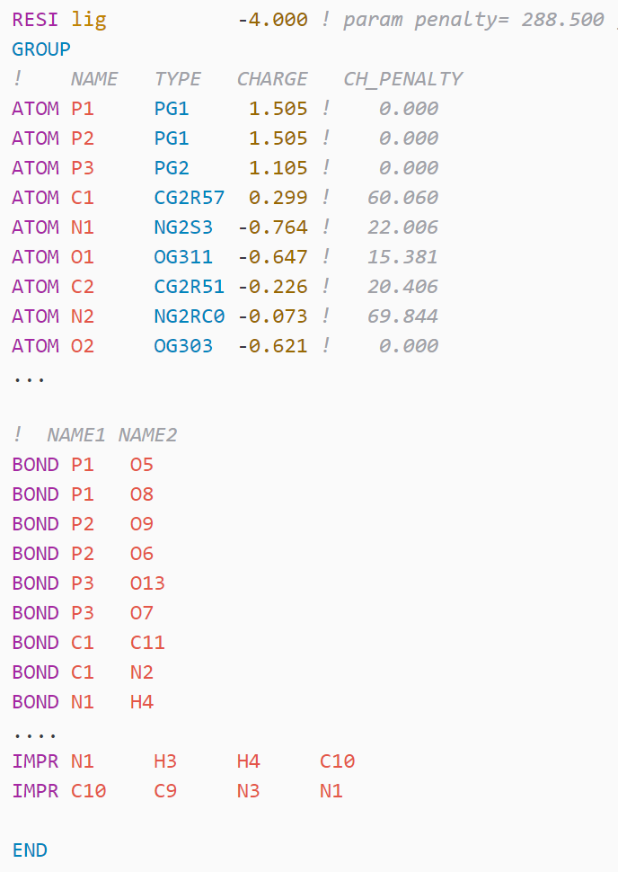

> 原子名字：橙红色；原子类型：蓝色

`.pdb`文件示例（和`.rtf`文件的原子名字部分对应）：

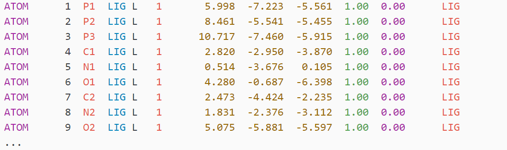

`.prm`文件示例（小分子一般都需要单独添加）：

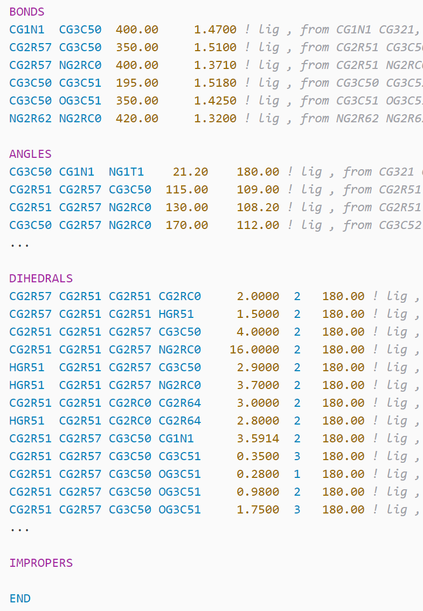

势能的表达式为
$$
\begin{align*}
V(\text{bond})&=K_{b}\left(b-b_0\right)^2\\
V(\text{angle})&=K_{\theta}\left(\theta-\theta_0\right)^2\\
V(\text{dihedral})&=K_{\chi}\left[1+\cos\left(n\chi-\delta\right)\right]
\end{align*}
$$

> - 二面角势能可能有多个$n$不同的项来叠加。
> - 这些参数在默认的CgenFF力场中并不存在，而是根据原子类型搜索到相似的键、键角、二面角（from xxx）的参数。
> - penalty值评价了两者的相似程度，我们暂不用管。

`.psf`文件示例（和`.pdb`文件的原子对应）：

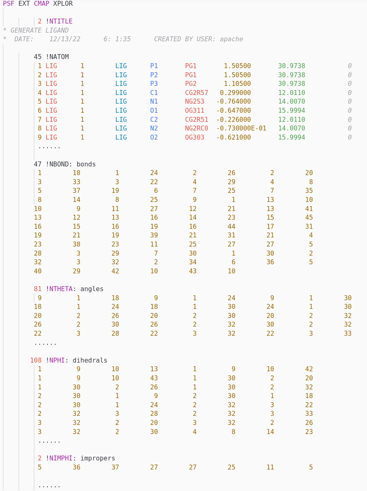

但我们不用它构建双拓扑文件，构建的是混合的`.rtf`文件。它们的关系是如下，只要有`.rtf`文件就能生成`.psf`文件。

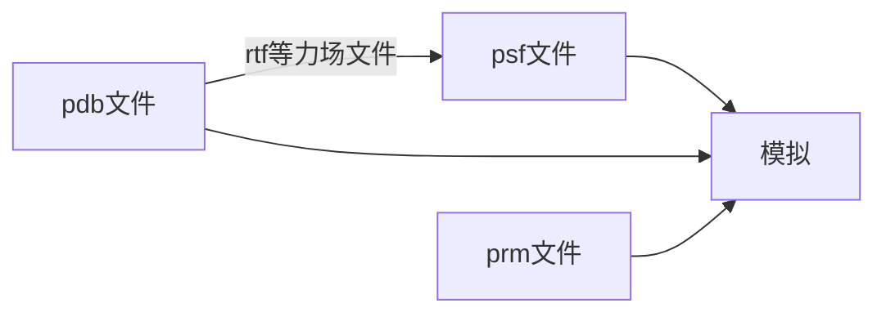
```mermaid
graph LR
pdb文件--rtf等力场文件-->psf文件-->模拟
pdb文件-->模拟
prm文件-->模拟
```

### 双拓扑vs单拓扑


> Gapsys, V., Michielssens, S., Peters, J. H., de Groot, B. L., & Leonov, H. (2015). Calculation of binding free energies. *Molecular Modeling of Proteins*, 173-209.

b图展示了双拓扑中的“混合分子”（hybirid molecule），分为公共部分、A、B三部分。

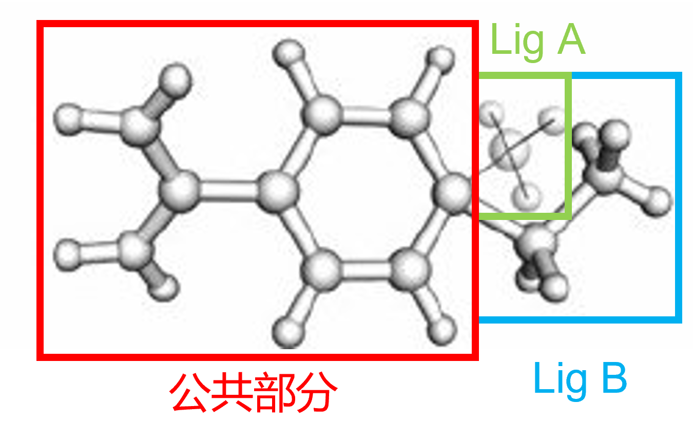

- 双拓扑的“消失态”和单拓扑的dummy是相同的；双拓扑不存在一个原子本身的参数发生变化，必须分别定义。
- 单拓扑中，lig A和lig B部分若各自对应dummy，公共部分被强制要求坐标、电荷、其他参数时刻相同，则与双拓扑相同。
- **双拓扑可以是一种特殊的单拓扑**

这就引入了一些问题，将在案例二中详述。

### <font color=red>小分子FEP体系构建的步骤</font>

1. 初步观察体系
2. 编辑小分子文件
3. 上传CHARMM-GUI做出力场文件
4. 确定公共部分，编辑公共原子和电荷
5. 完成三组文件的合并
   1. 编辑hybrid ligand的bond部分
   2. 编辑hybrid ligand的pdb文件
   3. 编辑hybrid ligand的prm文件

6. 检查双拓扑是否做对了
7. 后续流程（加溶剂，构建bound和unbound体系，提交任务）

手动制作双拓扑文件的流程如下（两个小分子分别记为ligand A和B）：

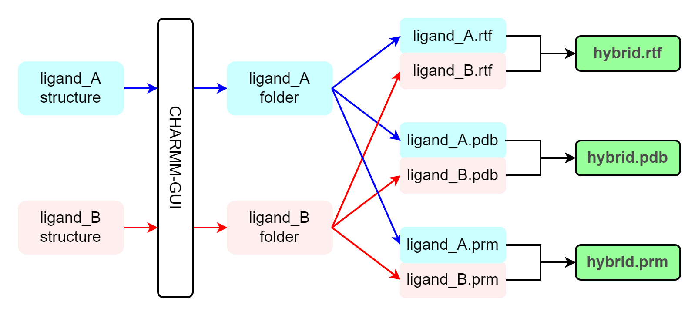

### 辅助工具

Pymol教育版：https://pymol.org/edu/。操作比vmd简便，推荐用于简单的可视化，**编辑很方便**。

文本编辑器：VScode等

> `~/xufan/md-highlighter-0.0.1`：自己写的vscode语法高亮插件，支持namd相关文件和`.mol2`, `.sdf`文件。
>
> 使用方法：把整个插件文件夹，拷贝到`%USERPROFILE%/.vscode/extensions`（Linux是`~/.vscode/extensions`），重启/reload VSCode就可以。
>
> gromacs相关文件请安装[`gromacs-helper`](https://marketplace.visualstudio.com/items?itemName=SupernovaZJX.gmx-helper)。

下载CHARMM力场文件：http://mackerell.umaryland.edu/charmm_ff.shtml

## 案例一：力场中有的分子

本例使用T4 lysozyme L99A和苯的衍生物。`cd ~/xufan/tutorial/T4-L99A/`

- 数据来源&FEP测试：https://www.nature.com/articles/s41598-019-53133-1

### 初步观察体系

体系就是一个蛋白、一个小分子。大家可以将`structure/c01_218.pdb`用pymol打开，直观地看一下。分别保存蛋白和小分子为`receptor.pdb`和`bben.pdb`。

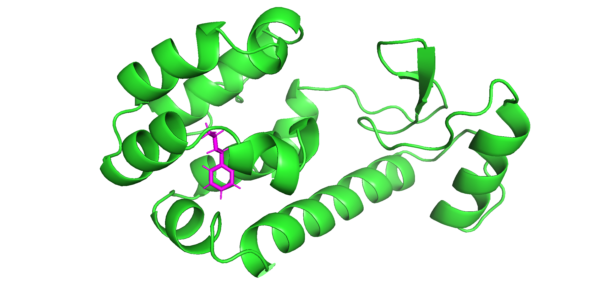

我们要做的是把正丁苯（BBEN）变成正丙苯（PBEN），即一个甲基变为氢。

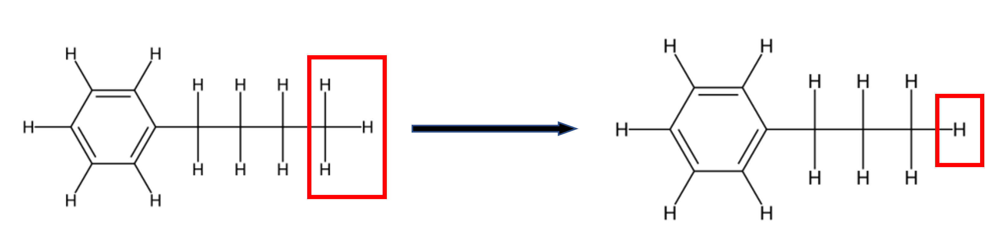

### 编辑小分子文件

1. <font color=red>演示</font>：用pymol打开`bben.pdb`，点击右上角的Builder
2. 点击C，再点击要替换掉的H原子
3. 命令行输入`save pben.pdb`，或菜单栏的`File--Export Molecule`

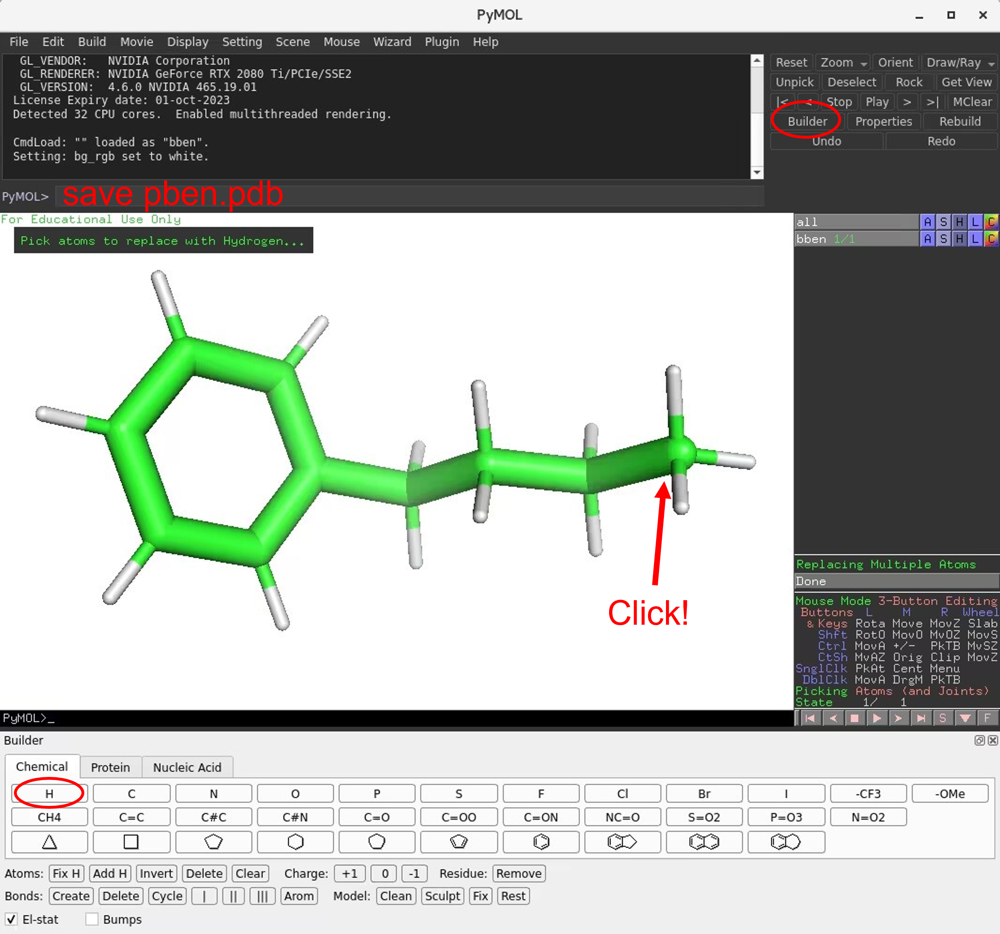

> 注意，这里的假设是，两个小分子（公共部分）的结合模式非常接近，非公共部分的差异可以在模拟中充分采样到。最好是两个小分子都跑MD验证，但实际操作中经常只跑其中一个。
>
> 所以我们采取编辑小分子的方式，公共部分的原子坐标**完全相同**，而非公共部分的初始坐标有一定随意性，一般就用pymol默认的（交叉式），注意不要和蛋白clash即可。CHARMM-GUI一般不会对坐标做大的改动。
>
> 为避免clash，一般把大的基团（`A`）变成小的基团（`B`）。

### 上传CHARMM-GUI

- 打开https://www.charmm-gui.org/?doc=input/ligandrm，上传pdb文件
- 突然发现力场中有这个分子，怎么办？

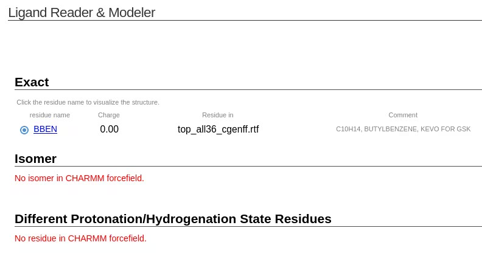  

我们只拿一个`ligandrm.pdb`文件。

### 获取residue topology

- <font color=red>演示</font>：打开`top_all36_cgenff.rtf`
- 根据残基名称找到正丁苯的拓扑
- 复制出来，命名为`bben.rtf`文件
- 同理，做出正丙苯的`.pdb`和`.rtf`文件
- 为节约时间，已经准备好，在`manual`文件夹下

### 编辑公共原子和电荷

> - 并排打开两个`.rtf`文件，分析区别：
>
>   - 哪些原子是特有的？
>   - 哪些原子是共有的，但原子类型不一样？
>   - 哪些原子的原子类型相同，但局部电荷相差较大（超过0.05）？
> - 重新考虑公共原子
>
>   - **原子类型不同或电荷相差较大**，不算作公共原子
>   - 非公共太多，相空间相差太大

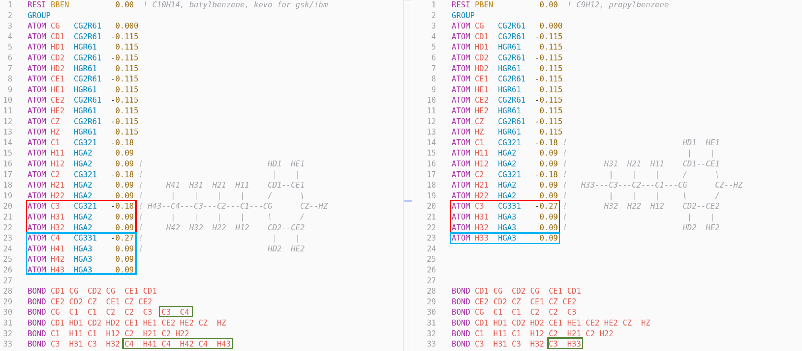

在本例中

- C4/H41/H42/H43和H33是不重合的原子
- C3原子类型不同，电荷也相差较大
- 由于NAMD的具体实现，<u>所有与非公共原子相连的氢原子也要归入非公共原子</u>

下图高亮出了我们选定的公共原子（主要看左半边）。

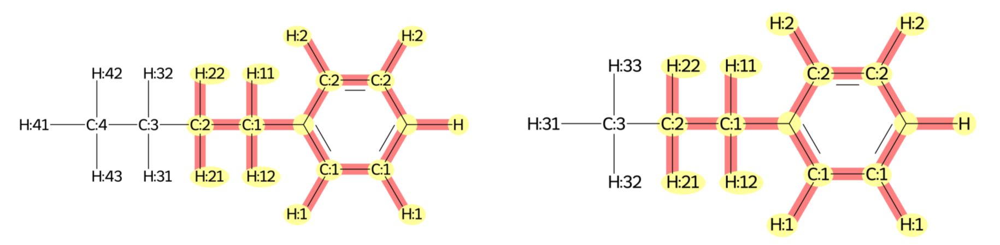

### 完成三组文件的合并

#### `hybrid.rtf`文件

修改BOND部分要注意不能遗漏或冗余，每两个相连的原子都要有一个BOND。如果想不清楚，可以参照下图的成键来编辑。

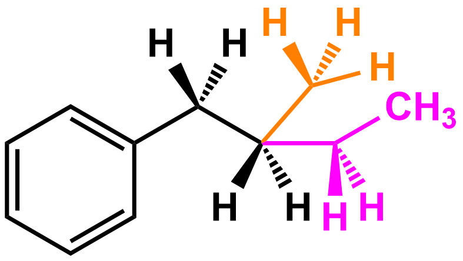

<center>我们做出来的混合分子。洋红色为初态，橙色为末态</center>

<font color=red>演示</font>，步骤：

- 复制一份，添加新原子
- 更改原子名字
- 添加新的键并更改相应的原子名字（添加`A`或`B`）

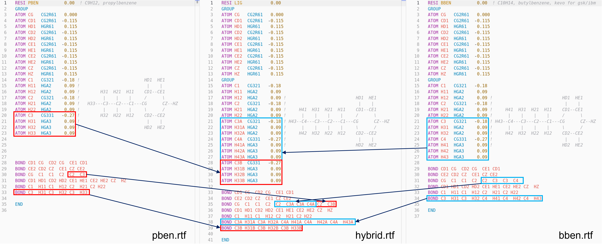

#### `hybrid.pdb`文件

- 添加新原子并更改原子名字
  - 注意，原子名不能超过四个字符，必须在第13~16列
  - 原子名和`.rtf`文件中的相同，虽然不一定按顺序对应（FEbuilder默认是一一对应的）
- 改beta值：要“消失”的原子为`-1.00`，要“长出来”的原子为`1.00`。
  - NAMD借此识别哪些原子要变
  - 添加`A`或`B`其实只是一个习惯，你可以改成任何名字

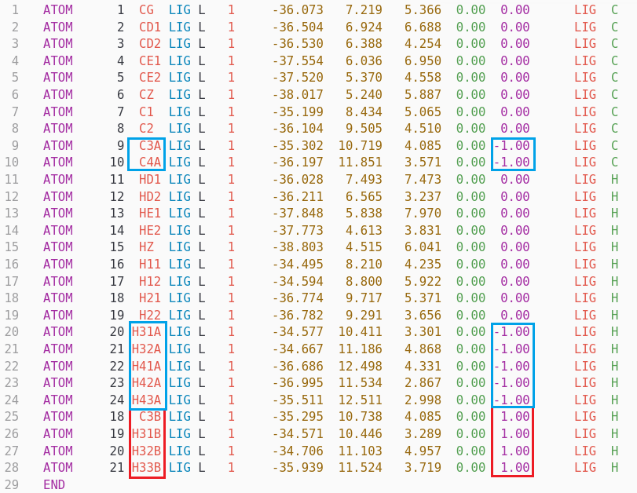

#### `hybrid.prm`文件

- 如有需要，添加一些丢失的参数（本例不需要，就不创建这个文件了）

### 检查双拓扑是否做对了

1. <font color=red>演示</font>：用Pymol打开`hybrid.pdb`。

   - 更改颜色：C---spectrum---b-factors
   - 标记原子：L---atom name
   - 红色代表要出现的（beta=`1`），蓝色代表要消失的（beta=`-1`）。
   - 红蓝相间意味着两原子几乎重合，没有关系，NAMD3会忽略alchemical atoms的相互作用，但还是要用soft-core。

   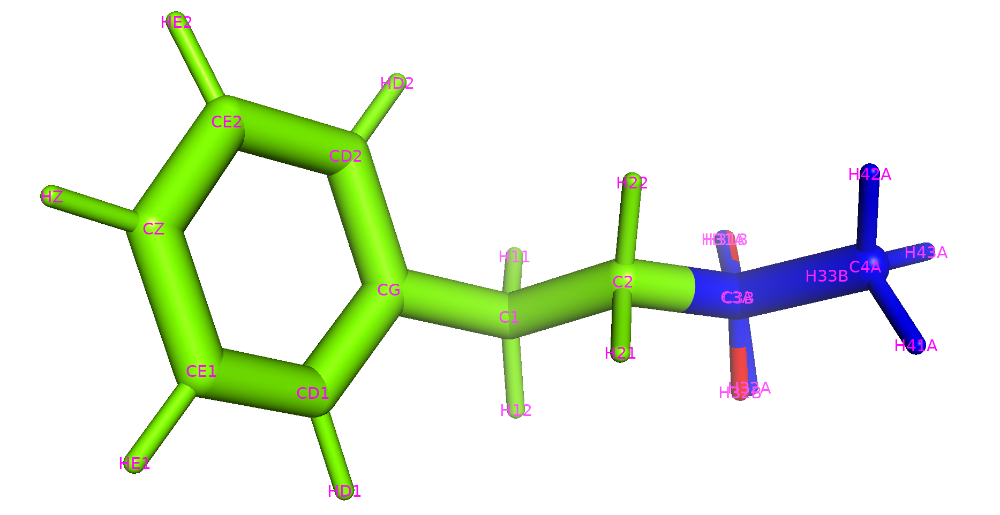

   > 课后练习：用VMD打开`hybrid.pdb`，Coloring Method选择Beta，只是蓝色代表要出现的原子。

2. 用vmd尝试参数化，无报错、键正确则`hybrid.rtf`文件正确

   ```tcl
   # 尝试参数化
   package require psfgen
   topology top_all36_cgenff.rtf
   topology hybrid.rtf
   segment LIG {pdb hybrid.pdb; first none; last none}
   coordpdb hybrid.pdb LIG
   # 保存
   writepdb hybrid_check.pdb
   writepsf hybrid_check.psf
   resetpsf
   # 加载psf文件，然后检查分子结构
   mol load psf hybrid_check.psf pdb hybrid_check.pdb
   ```


> 总结：对于CgenFF中有的小分子、结构比较常见的小分子，其电荷分布是**高度模块化、具有可迁移性**的，比如一个CH<sub>2</sub>、CH<sub>3</sub>的总电荷为零。20种氨基酸的双拓扑大多可以用这样的模块去理解，在`.rtf`文件中，用`GROUP`关键字分割。
>
> 课后作业：请随意挑选几个氨基酸对（如S2T, V2L, F2Y等），根据两个氨基酸的`rtf`手动写出氨基酸突变的`rtf`（先忽略IC），并与`~/xufan/tutorial/toppar/top_all36_hybrid.inp`中的结果对照。

## 案例二：一般小分子

本例使用HIF2α及其抑制剂。`cd ~/xufan/tutorial/HIF2a/`

- 原始论文：https://doi.org/10.1158/0008-5472.CAN-16-0473
- 整理后的活性数据：https://github.com/openforcefield/protein-ligand-benchmark

### 初步观察体系

体系就是一个蛋白、一个小分子。大家可以将`structure/c01_274.pdb`用pymol打开，直观地看一下。分别保存蛋白和小分子为`receptor.pdb`和`a.pdb`。

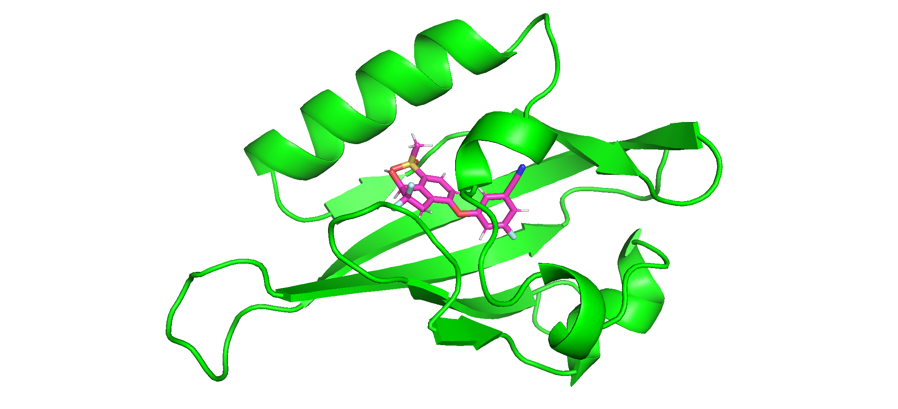

我们要做的变化是F变成H（分别记为ligand A和B）。

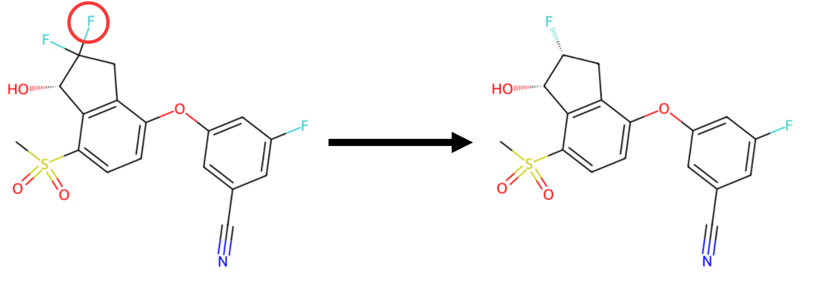

### 编辑小分子文件

同上，就不演示了。

1. 用pymol打开`a.pdb`，点击右上角的Builder
2. 点击H，再点击要替换掉的F原子
3. 命令行输入`save b.pdb`，或菜单栏的File--Export Molecule
4. 注意看清手性

### 上传CHARMM-GUI

- 打开https://www.charmm-gui.org/?doc=input/ligandrm，上传pdb文件
- 在界面中仔细检查结构是否正确
- 在CgenFF中没找到这个小分子。点点点，下载文件夹。
- 我们要的是`ligandrm.pdb`,  `lig/lig.rtf`,  `lig/lig.prm`，复制出来重命名。
- 为节约时间，已经准备了下载好的，在`manual`文件夹下。

### 编辑公共原子和电荷

> - 并排打开两个`.rtf`文件，分析区别：
>
>   - 哪些原子是特有的？
>   - 哪些原子是共有的，但原子类型不一样？
>   - 哪些原子的原子类型相同，但局部电荷相差较大（超过0.05）？
>
> - 重新考虑公共原子
>
>   - 原子类型不同或电荷相差较大，不算作公共原子
>   - 非公共太多，相空间相差太大
>   - 可以编辑电荷，反正不太准...

排除原子类型不同的C17和F2，下图中高亮了所有公共原子：

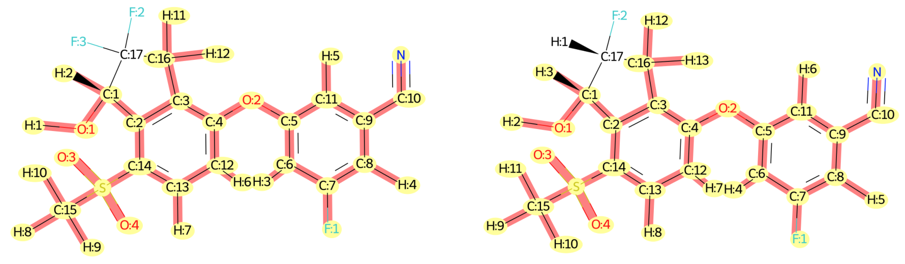

但绿色框中的原子是电荷不同的公共原子

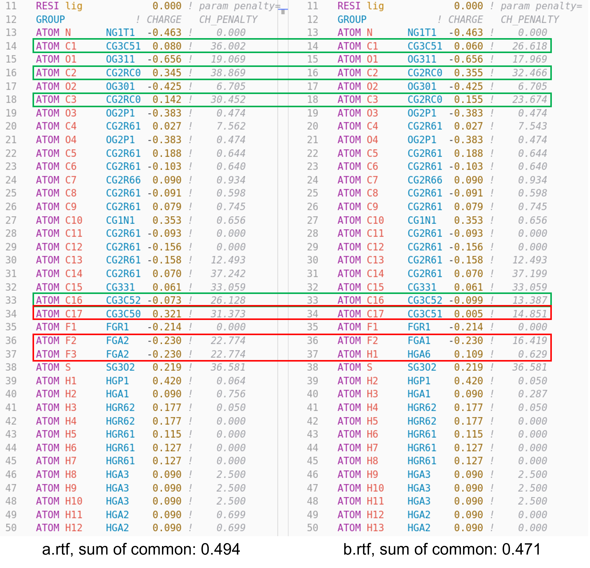

在FEP中，电荷需满足以下的原则
$$
q_a=q_a^c+q_a^u \quad (\mathrm{ligand\ A})\\
q_b=q_b^c+q_b^u \quad (\mathrm{ligand\ B})
$$

> u: uncommon; c: common

$q_a=q_b$；公共部分使用同一套原子，则$q_a^c=q_b^c$，故$q_a^u=q_b^u$；但是GUI给出的$q_a^c\neq q_b^c$

一种想法是把绿色框出的原子全部排除出公共原子，但是这样非公共部分太大了，分子构象可能不稳定。

本例以ligand A为参考，采用它的公共原子的电荷（适合于从一个化合物出发，尝试多个突变）

但此时$q_a^c+q_b^u\neq q_b$，所以只能修改$q_b^u$。这里出现了一个单拓扑中不会出现的现象！

所以，把ligand B多余的电荷加到非公共的碳原子上

- 计算多余电荷：$\delta q=q_b-(q_a^c+q_b^u)=q_b^c-q_a^c=q_a^u-q_b^u=-0.023$
- 修改：$q_b^u=q_b^u+\delta q$

> 这里不更改F2和H1，是因为二者处于分子最外层，直接和蛋白接触，尽量不要改它们的参数；
>
> 同时H1是发生变化的原子，也尽量不要改。

在本例中，就是要将C17(B)的电荷调整为：$0.005-0.023=-0.018$

问题？

### 完成三组文件的合并

#### `hybrid.rtf`文件

编辑键

- C17和F2B/H1B，复制一份
- C17和公共原子的键，复制一份

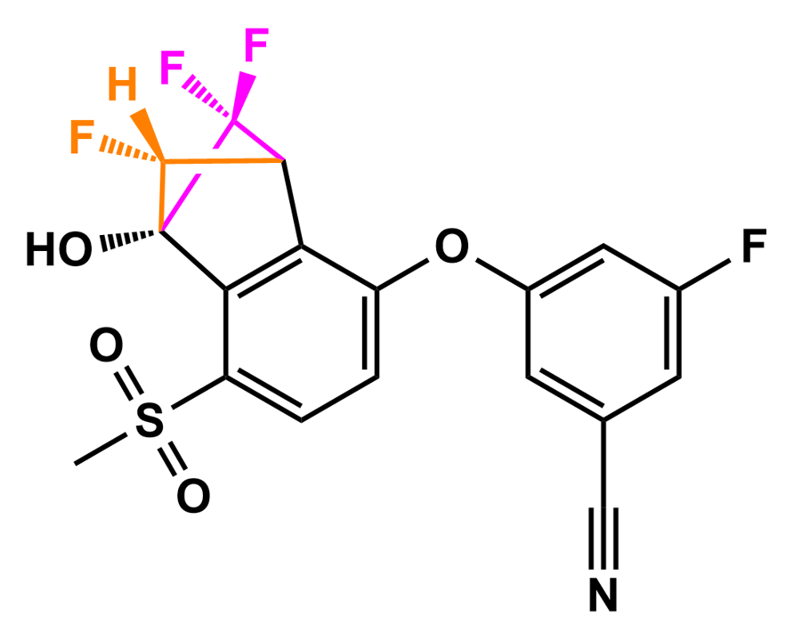  
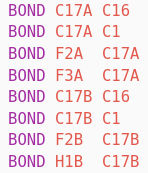  

<center>我们做出来的混合分子。洋红色为初态，橙色为末态</center>

#### `hybrid.pdb`文件

和之前类似

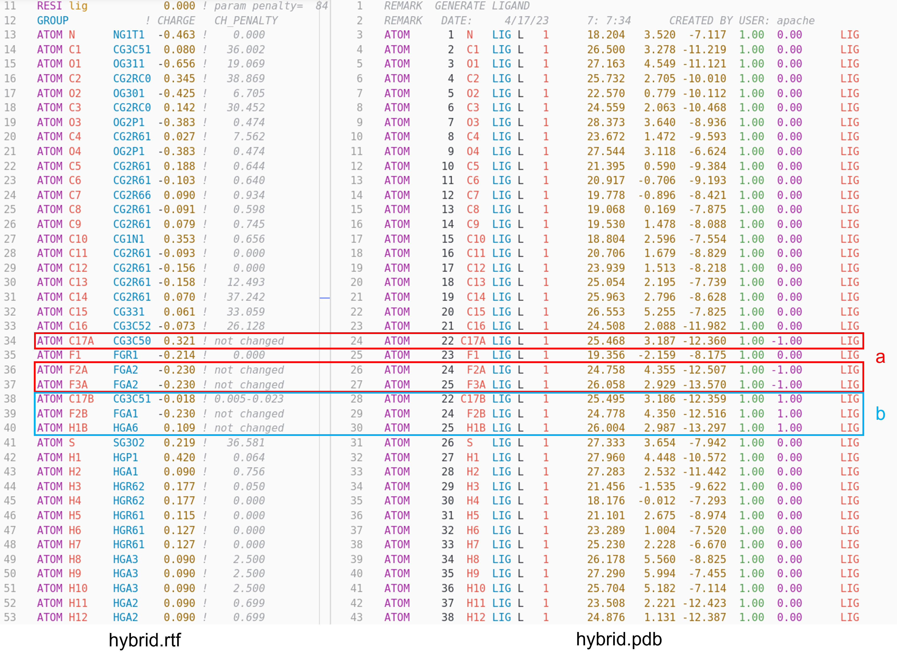  

#### `hybrid.prm`文件

对于`BONDS`, `ANGLES`, `DIHEDRALS`三个部分，都需要取并集/去除重复项，手动做很麻烦。

技巧：vscode中File---Open Folder，侧边栏选中这两个文件，右键---Compare Selected，发现了多出来的项，粘贴过来即可。

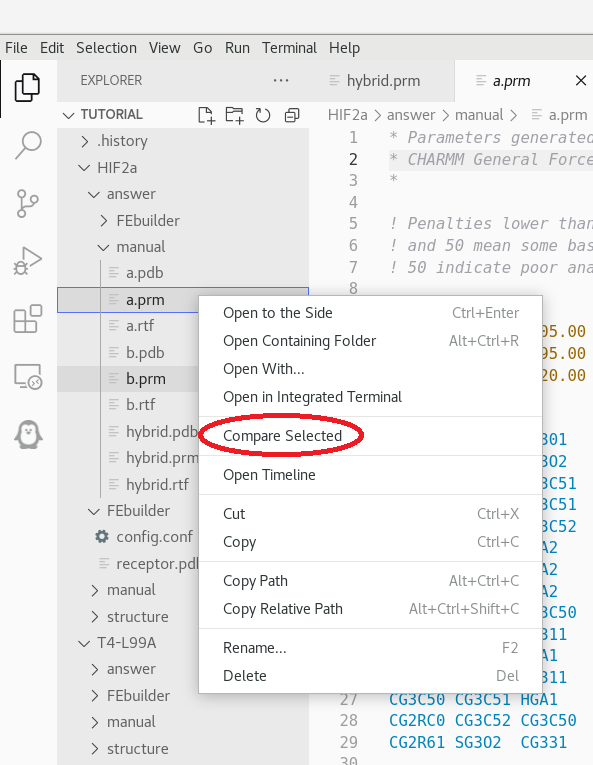  
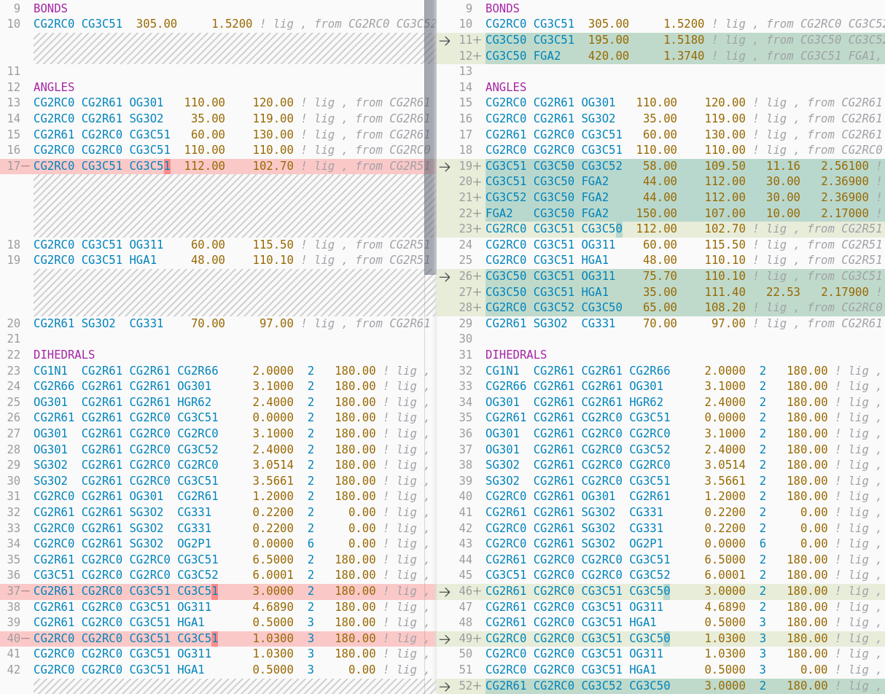  

检查双拓扑是否做对了：同上，用Pymol/VMD打开`hybrid.pdb`。

> 总结：类似的流程；编辑电荷：公共部分按ligand A的---计算需要补的电荷---确定要加在哪几个原子上---计算最终电荷；prm文件的合并
>
> 课后作业：请复现以上操作流程，并与`answer/manual`和`answer/FEbuilder`中的结果对照。

## 自编程序FEbuilder的使用

### [安装](FEbuilder/docs/build/html/installation.html)

安装vmd，并添加到`PATH`

创建conda环境，下载依赖包（openbabel也可单独安装，并添加到`PATH`: https://github.com/openbabel/openbabel/releases/tag/openbabel-3-1-1）

```shell
conda create -c conda-forge -n FEbuilder rdkit openbabel python==3.9 -y
```

在工作目录下打开cmd，激活conda环境，查看帮助：

```
conda activate FEbuilder
python E:\GitHub-repo\make_hybrid_top\FEbuilder\FEbuilder.py -h
```

### 测试案例二

<font color=red>演示</font>：把两个文件夹、`receptor.pdb`、`config.conf`放在同一文件夹。回到命令行，输入

```shell
python E:\GitHub-repo\make_hybrid_top\FEbuilder\FEbuilder.py -v -ref a -mut b --ff-path ../../toppar --obabel-path 'D:\Program Files (x86)\OpenBabel-3.1.1\obabel.exe'
```

打开`config.conf`，类似的写法，更方便一些。

```
[Fundamental]
ref = a
mut = b
rec = receptor.pdb
# recpsf = receptor.psf
ff_path = ../../toppar

[System]
obabel_path = 'D:\Program Files (x86)\OpenBabel-3.1.1\obabel.exe'

[Model]
no_solvate = False
charge_mode = mode2
distance = 12

[Simulation]
numofsteps = 510000
repeats = 4

[Other]
verbose = on
```

执行

```shell
python E:\GitHub-repo\make_hybrid_top\FEbuilder\FEbuilder.py -config config.conf
```

- 弹出高亮了公共原子的界面。
- 对照图片阅读输出信息，哪些被排除在公共原子之外。这里不要修改，直接按Enter。
- 下一步弹出不能更改电荷的原子，演示一下如何编辑。
- vmd加溶剂比较漫长。详细的构建信息参见`other/merge-and-solvate.tcl`

> 课后作业：测试案例一。把两个分子的两个文件、`receptor.pdb`、`config.conf`放在同一文件夹。
>
> 注意设置`params = in-cgenff`（或命令行添加选项：`-params in-cgenff`）。

### 运行结果

- 输出的信息已经保存在`other/FEbuilder.log`，方便回溯电荷的编辑过程。
- 检查双拓扑是否做对了：用Pymol打开`other/hybrid.pdb`，和之前一样。

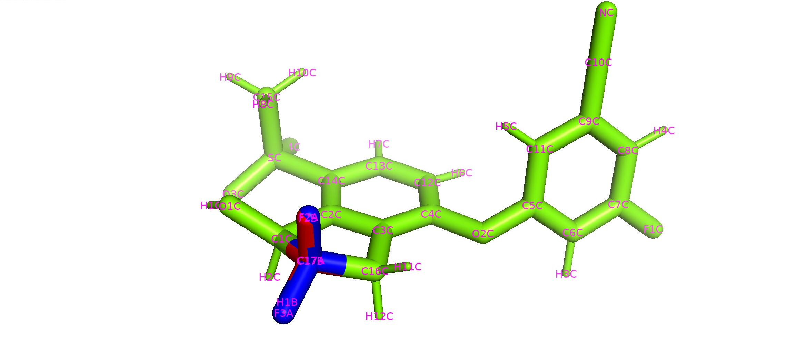  

- 把`simulation`文件夹放到集群上，执行`prod/batch_submit.sh`批量提交。文件结构如下：

  ```shell
  simulation/
  ├── common
  │   ├── complex-fep.pdb
  │   ├── complex-fep.psf
  │   ├── fep.tcl
  │   ├── ligand-fep.pdb
  │   ├── ligand-fep.psf
  │   ├── measure-fep.tcl
  │   ├── PBCBOX-complex.dat
  │   ├── PBCBOX-ligand.dat
  │   └── toppar
  ├── equil
  │   ├── clear_equil.sh
  │   ├── complex1
  │   ├── complex2
  │   ├── complex3
  │   ├── complex4
  │   ├── ligand1
  │   ├── ligand2
  │   ├── ligand3
  │   └── ligand4
  └── prod
      ├── batch_submit.sh
      ├── complex1
      ├── complex2
      ├── complex3
      ├── complex4
      ├── fep.pbs.sh
      ├── ligand1
      ├── ligand2
      ├── ligand3
      ├── ligand4
      └── qdel_all.sh
  ```

  文件夹`complex*`和`ligand*`分别指的是bound和unbound/free状态（历史原因，不想再改了），即蛋白+小分子和只有小分子的体系，二者被放入同样大小的盒子（尤其是FEP涉及电荷变化时），添加水和离子。分别重复3~5次，先在`equil`文件夹下预平衡，再在`prod`文件夹下收集数据。

  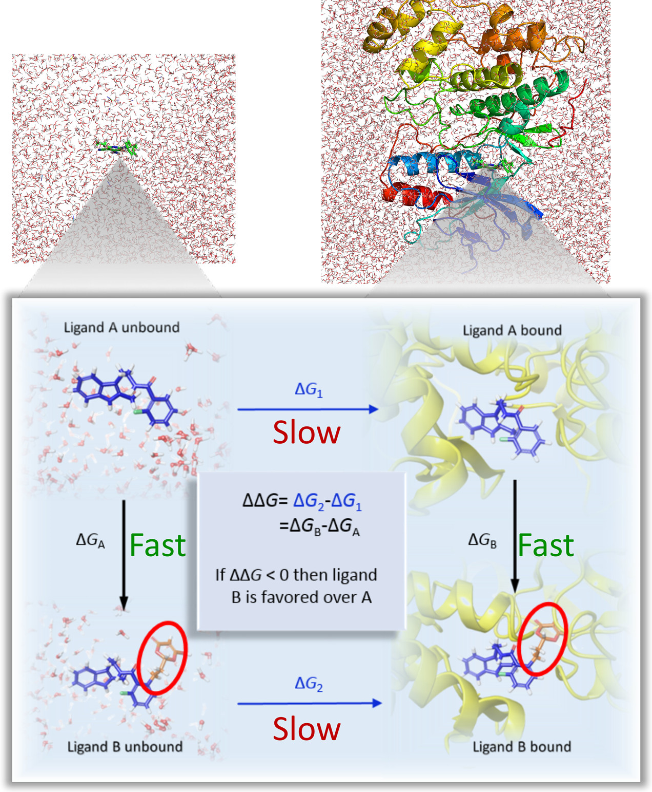

- 如果需要更改NAMD参数，直接去代码包里改。

## 运行和结果分析

和一般FEP相同。

### 运行建议

- FEP前有一段平衡，时间不要太长（默认：`-equilsteps 10000`）
- 我用的是32 windows*1ns（默认），算是比较长的了，根据需要修改（`-numofsteps`）
- 尽量不要中断（参考`simulation/common/fep.tcl`中的`runFEP_restart`）

检查跑了多少window

```shell
# under complex* or ligand*
alias grepfep='grep "FEP window" *log'
```

### 获取dG

`.fepout`文件在每个window结束后都会有一行总结：

```
#Free energy change for lambda window [ 0.99999 1 ] is -0.000245697 ; net change until now is -9.94077
```

批量提取FEP结果

```shell
# under prod
alias getallfepout='for f in `ls | grep l`; do echo $f; cd $f && tail -n 1 *fepout | cut -d " " -f 19 && cd ..; done'
```

画dG-λ图：`~/xufan/tutorial/analysis/dg-lambda.py`

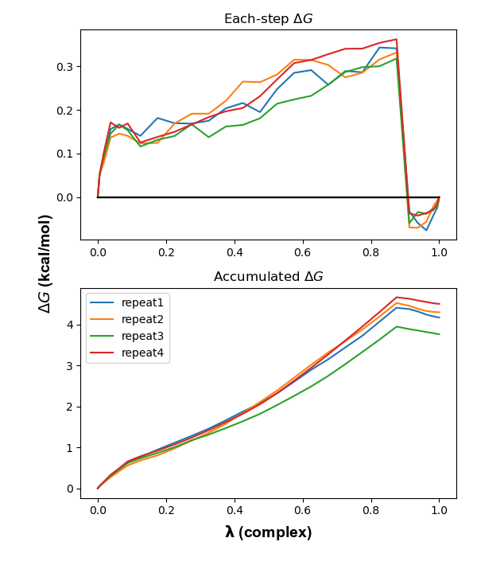  

做能量分解：`~/xufan/tutorial/analysis/decomposition.py`，用了Kevin的脚本。

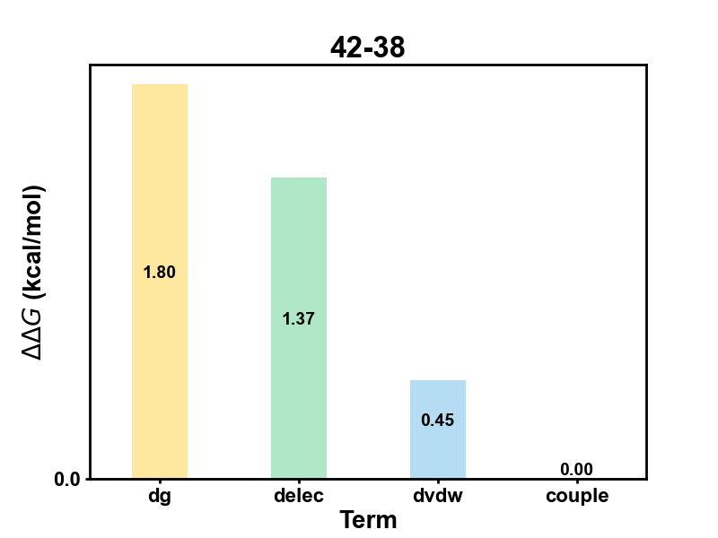  

## 讨论

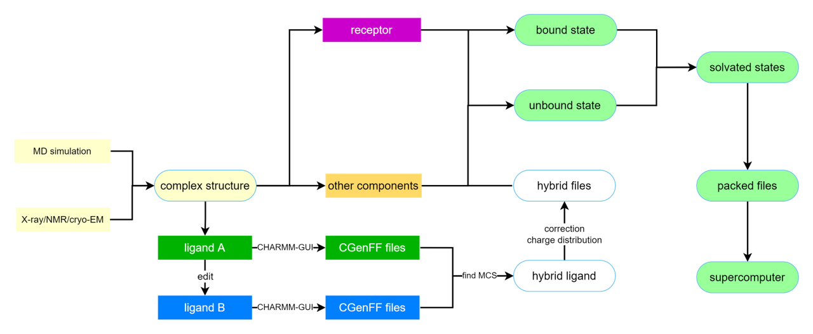  

### 小分子FEP的四要素

- 复合物结构：尽量准确。实验解析；预测算法
- 力场的选择：GAFF，CgenFF，OPLS，openFF....
- 拓扑的构建：单/双拓扑，公共原子，调整电荷
- 模拟的参数：时长，窗口，增强采样
- 其他细节

个人理解

- 现在常用免费MD engine中只有NAMD在用双拓扑，但没有很好的小分子的自动化搭建程序（或教程）；我们能做的改进不多，加REST成为各工具的常规操作；
- 流程也算标准化，但手动做也非没有技术含量；做hybrid topology更像一种艺术，无固定的标准，有时这样准有时不准
- FEP在药物研发中的作用日益凸显，各工具都声称达到平均~1 kcal/mol的精度，主要用在hit-to-lead和lead-optimization，计算量较大限制其用于筛选和打分函数。
- 如果你信任它，可以为实验提供候选化合物；如果不够信任（或没实验验证），也可以用它探究口袋性质
- 仍挑战性的问题：scaffold hopping，ring breaking/formation, "large perturbation", pathway design....

### open question

1. 单拓扑vs双拓扑
   - 双拓扑改了电荷，严格来说$a\to b\to c\to a$已不是闭环。。单拓扑不用改电荷，更准？没有明确单拓扑和双拓扑哪个更准？
   - 有人认为单拓扑下最好还是不要变得太大，比如C变成O，那就接近双拓扑了
   - 还有什么问题，欢迎讨论
2. 保留局部电荷的改变，还是减少非公共部分？
   - 案例一的另一种做法：第三个C也是公共部分，H33B的电荷改为0（`~/xufan/tutorial/T4-L99A/answer/manual/hybrid2.rtf`）。Leili师兄早期手动做时曾如此，但也只是为了简单。
   - 案例二的另一种做法：公共原子的电荷取平均值，这样ligand A和B的电荷都要修改，修改的量少一些；但二者都已经不是最初的电荷了。
   - 个人觉得应做一个平衡，非公共部分在要变的原子附近1~2层之内。

### 拓展阅读

- CgenFF力场如何确定小分子的各种参数？
  - https://pubs.acs.org/doi/10.1021/ci300363c
  - https://pubs.acs.org/doi/10.1021/ci3003649
- 关于不同力场、软件在不同数据集上的表现，请参考文献：`~/xufan/benchmarking-paper`
- 关于实操的文献资料：`~/xufan/practice-paper`


<center><font size=5>欢迎批评指正！谢谢大家！</font></center>
