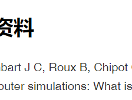

👏 计算机辅助标准结合自由能计算最好的策略是什么

---
[TOC]

---

## 参考资料
1. Gumbart J C, Roux B, Chipot C. Standard binding free energies from computer simulations: What is the best strategy?[J]. Journal of chemical theory and computation, 2013, 9(1): 794-802.