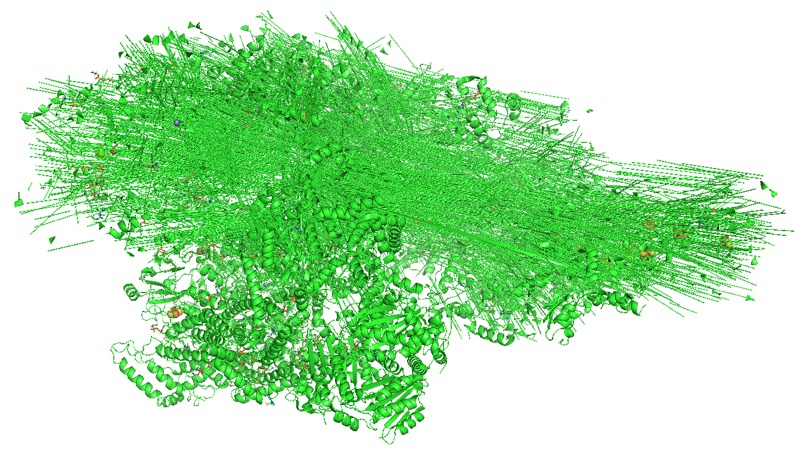

👏 超大蛋白文件处理技巧

---
[TOC]

---
## 显示问题
pdb文件的原子数目是有上限规定的（99999）。原子数目超过99999时目前一般采用cif文件。但是进行MD模拟的时候还是需要pdb文件。所以这里将使用pdb进行方便的存储以及显示超大分子文件。   

**链问题：**
pymol等可视化软件识别的链号码只有一位字符。如果链号码有重复的话则会出现下面乱码的情况：  

为了解决上述链号码重复问题，需要对每个链都重新给一个特定的名称。但是英文字母有限，所以这里可以通过引入链的更高一级segment。  
segment最多可以用四个字符进行表示，不同的segment中是允许同一号码的链号而不出现乱码的。  
具体操作可参考脚本：mk_rename_chain_for_supermacropro.py   
处理完成之后会发现用pymol打开的话编号大于99999的原子的cartoon形式全部都是loop，在vmd中均可正常显示。  