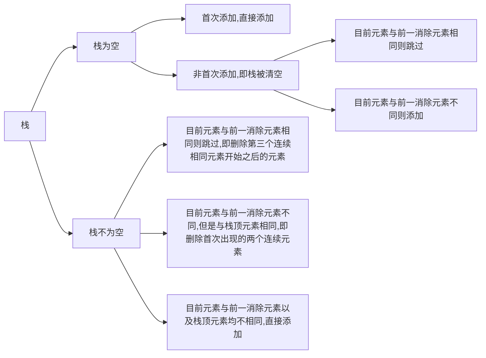

👏 面试题|字符串消消乐

---
[TOC]

---
## 思路
(1) 主要用到栈的数据结构。先进后出。  
(2) 创建一个空列表用于存储消除后的字符，创建一个变量用于存储前一个被消除的元素。如下：


---
## 脚本
### 标准答案
```python
import sys

def process(str_test):
    s = []
    # 前一个被消除的元素
    del_str = ''
    for i in str_test:
        # 栈为空，直接添加入栈
        if len(s) == 0:
            if del_str == '':
                # 判断是首次添加，无消除字符
                s.append(i)
            else:
                # 如果不是首次，列表被删空了
                if i == del_str:
                    # 如果相等不做处理
                    continue
                else:
                    s.append(i)
                    del_str = ''  # 还原del_str
        else:
            # 判断i 与被前一个被消除的元素是都相等
            if i == del_str:
                # 如果相等不做处理
                continue
            # 判断 i 与栈顶元素是否相等
            elif i == s[-1]:
                # 弹出栈顶元素
                del_str = s.pop(-1)
            else:
                # 入栈
                s.append(i)
                del_str = ''  # 还原del_str
    print("".join(s))

def main():
    str_1 = sys.argv[1]
    process(str_1)

if __name__ == '__main__':
    main()
```

### 其他方法
```python
import sys

def delete_copy(str_1):
    final_word = []
    str_1 = list(str(str_1))
    for i in range(len(str_1)):
        if i == 0 and str_1[i] != str_1[i + 1]:
            final_word.append(str_1[0])
        if i >= 1 and i < len(str_1) - 1:
            if str_1[i] != str_1[i - 1] and str_1[i] != str_1[i + 1]:
                final_word.append(str_1[i])
        if i == len(str_1) - 1 and str_1[i] != str_1[i - 1]:
            final_word.append(str_1[i])
    result = "".join(final_word)
    print (result)
    return result

def main():
    str_1 = sys.argv[1]
    str_2 = ""
    i = 1
    while i != 0:
        str_2 = delete_copy(str_1)
        if str_2 == str_1:
            i -= 1
        else:
            str_1 = str_2

if __name__ == '__main__':
    main()
```

---
## 参考资料
1. https://www.cnblogs.com/yoyoketang/p/14674340.html  