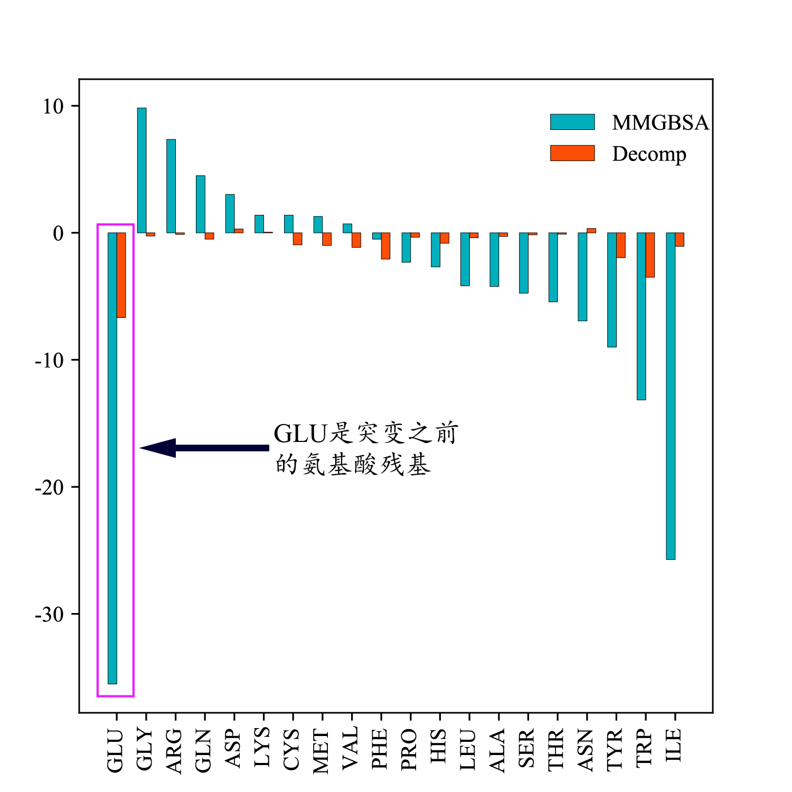
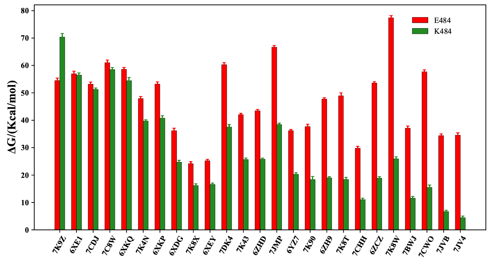
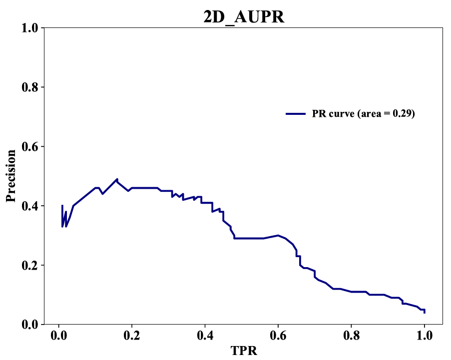
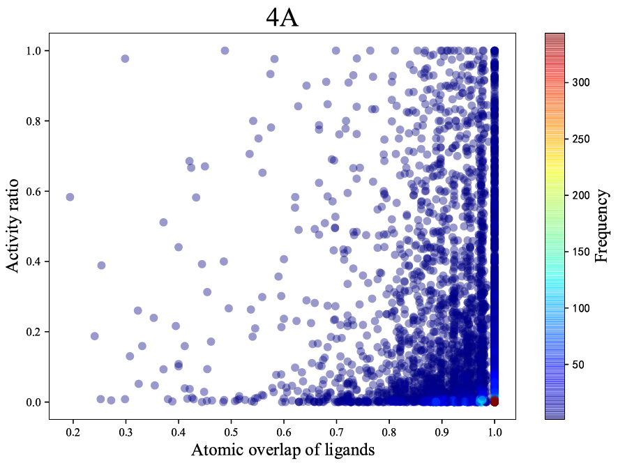
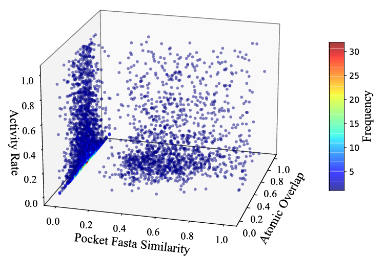
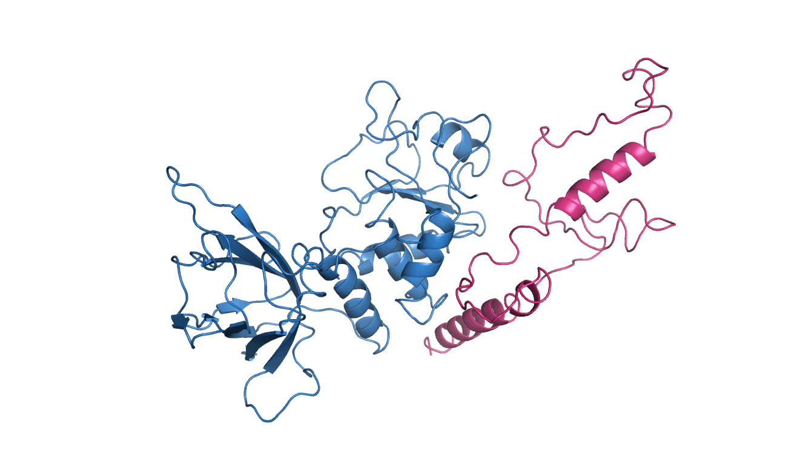
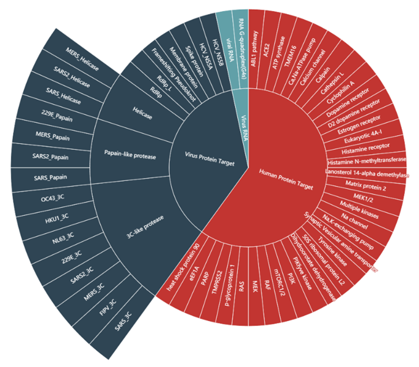
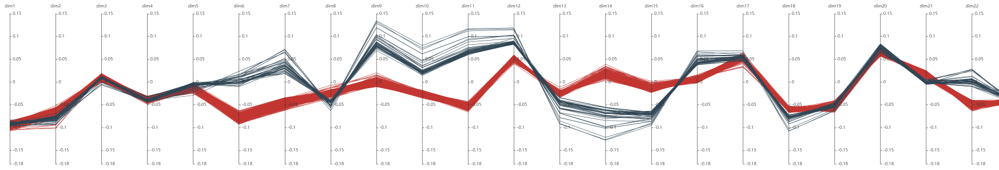

👏 gallery

---
[TOC]

---
## 1. 类别比较型图表

### 1.1 柱状图系列

#### 1.1.1 单数据系列柱状图
(1) [普通单数据系列柱状图](./File/Python绘图普通单数据系列柱状图.md)

  

#### 1.1.2 双数据系列柱状图
(1) [双数据系列柱状图](./File/Python绘图双数据系列柱状图.md)

  

    

  

    

  

    

  

    

### 1.2 径向柱图

#### 1.2.1 单数据系列径向柱图

  

 

---
## 2. 数据关系型图表

### 2.1 散点图系列

  

 

---
## 3. 数据分布型图表

---
## 4. 时间序列型图表

### 4.1 折线图

  

 

### 4.2 ROC_PR曲线

  

 

  

 

### 4.3 [多曲线](./File/Python绘图Python绘制多曲线图.md)

  

 

---
## 5. 局部整体型图表

---
## 6. [高维数据型图表](./高维数据型图表.md)

### 6.1 多维平面散点图

  

 

### 6.2 四维立体散点图

  

 

---
## 7. [组图](./组图.md)

  

 

  

 

---
## 8. [GIF动态图](./File/Python绘图Python将多张静态图片合成gif动态图片.md)

  

 

---
## 9. [分子指纹图](./File/Python绘图使用RDKit包绘制分子指纹图.md)

  

---
## 10. 组合图

### 10.1 柱状图与折线图组合图

  

---
## 11. [Turtle图](./Turtle图.md)

### 11.1 魔法图

  

---
## 12. [交互图](./交互图.md)

### 12.1 类别网络图(从属关系)

  

### 12.2 扇形图(从属关系)

  

### 12.3 平行坐标系图(多维)

  

